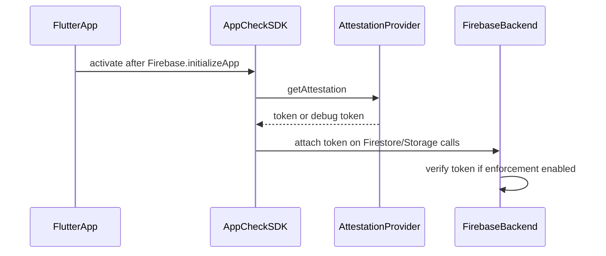

# App Check — DEV setup + PROD TODO

## Current state

- No App Check SDK or console setup in the repo ([`apps/multichoice/pubspec.yaml`](apps/multichoice/pubspec.yaml) has no `firebase_app_check`).
- Firebase init is in [`apps/multichoice/lib/app/bootstrap/bootstrap.dart`](apps/multichoice/lib/app/bootstrap/bootstrap.dart) via `setupFirebase()`.
- Android-only flavors: DEV `co.za.zanderkotze.multichoice.dev` → [`multichoice-app-develop`](https://console.firebase.google.com/u/0/project/multichoice-app-develop/appcheck); PROD `co.za.zanderkotze.multichoice` → `multichoice-412309`.
- Backend surfaces to protect: **Firestore** (feedback writes) and **Storage** (feedback images). Rules today allow broad client writes ([`firebase/firestore.rules`](firebase/firestore.rules), [`firebase/storage.rules`](firebase/storage.rules)).

## Does PROD need a new release?

| Action | Needs new PROD release? |
|--------|-------------------------|
| Register App Check in Firebase Console, add SHA-256, link Play Integrity API | No |
| Merge App Check SDK code (with enforcement **off**) | No — old builds keep working |
| Turn on **enforcement** for Firestore/Storage | **Yes** — only clients with the SDK send valid tokens |

**Recommendation:** Ship the same code for both flavors now; fully enforce on DEV after verification; leave PROD in monitoring until the next Play Store release is widely installed, then enforce (documented in PROD TODO).

## Architecture



## Code changes (implementation)

### 1. Add dependency

In [`apps/multichoice/pubspec.yaml`](apps/multichoice/pubspec.yaml):

```yaml
firebase_app_check: ^0.4.1+2  # align with firebase_core ^4.4.0
```

### 2. App Check activation module

New file: `apps/multichoice/lib/app/bootstrap/app_check_setup.dart`

Provider selection (Android-only today):

```dart
Future<void> setupAppCheck() async {
  if (kIsWeb) return; // web not in scope; no ReCAPTCHA keys in config yet

  final useDebugProvider =
      AppFlavor.isDev || kDebugMode; // DEV App Distribution release builds need debug

  await FirebaseAppCheck.instance.activate(
    androidProvider: useDebugProvider
        ? AndroidProvider.debug
        : AndroidProvider.playIntegrity,
  );
}
```

- **DEV flavor (any build mode):** `AndroidProvider.debug` — required because DEV release APKs go to Firebase App Distribution, not Play Store; Play Integrity will not attest those builds reliably.
- **PROD flavor debug/profile:** debug provider for local testing.
- **PROD flavor release:** Play Integrity (Play Store distribution).

Call from `setupFirebase()` in [`bootstrap.dart`](apps/multichoice/lib/app/bootstrap/bootstrap.dart) immediately after `Firebase.initializeApp()`.

### 3. Logging

After activation in debug/dev, log a reminder to register the debug token (token appears in logcat as `App Check debug token:` per [Firebase debug provider docs](https://firebase.google.com/docs/app-check/flutter/debug-provider)).

### 4. Tests

No bootstrap tests exist today. If widget/integration tests start failing on Firebase init, mock or skip App Check in test bindings — not expected for current unit tests.

---

## Your steps — DEV (`multichoice-app-develop`)

Complete in order. Console link: [App Check — develop](https://console.firebase.google.com/u/0/project/multichoice-app-develop/appcheck).

### A. Register the Android app for App Check

1. Open **App Check** → **Apps**.
2. Select the Android app for package `co.za.zanderkotze.multichoice.dev` (register in Project Settings first if missing).
3. **Play Integrity** provider:
   - Add **SHA-256** fingerprints:
     - Local debug keystore (`keytool -list -v -alias androiddebugkey -keystore %USERPROFILE%\.android\debug.keystore`, password `android`).
     - Release signing key used for DEV CI builds (same keystore as prod signing per [`environment-config.md`](docs/environment-config.md) — add that SHA-256 too).
   - Save provider config (even though DEV builds will use debug provider in code, registering Play Integrity is harmless and needed if you ever test PROD-like release paths).

### B. Debug provider + debug tokens

1. In App Check → Apps → `co.za.zanderkotze.multichoice.dev` → **Manage debug tokens**.
2. Run the app locally after code merge:
   ```bash
   cd apps/multichoice
   flutter run --target lib/main_develop.dart --flavor dev \
     --dart-define-from-file=config/develop_config.json
   ```
3. In logcat / debug console, find `App Check debug token: ...` and **register that token** in the console.
4. Repeat for each machine/emulator (each generates its own token).
5. For **CI / App Distribution DEV release builds**: after the first install, extract token from logcat on a test device and register it (or use a shared debug token workflow). DEV flavor always uses debug provider, so tokens are required for those builds too.

### C. Play Integrity API (PROD-focused, optional for DEV package)

Only needed when PROD release builds use Play Integrity. Safe to do now:

1. [Play Console](https://play.google.com/console) → **Multichoice** (prod app) → **Release** → **App integrity** → **Play Integrity API**.
2. Link the Google Cloud project tied to `multichoice-412309` / Firebase.
3. Copy **App signing key certificate SHA-256** from Play Console → add in Firebase **PROD** App Check Play Integrity config (see PROD TODO doc).

The DEV package is likely **not** on Play Store; do not block DEV setup on Play Integrity for `.dev` package.

### D. Enable monitoring, then enforcement (Firestore + Storage only)

For each API in [App Check → APIs](https://console.firebase.google.com/u/0/project/multichoice-app-develop/appcheck):

| API | Action |
|-----|--------|
| **Cloud Firestore** | Enable App Check → start **Unenforced** (monitoring) |
| **Cloud Storage** | Same |
| **Authentication** | Leave unenforced (out of scope) |
| **Remote Config** | Leave unenforced (out of scope) |

**Verification before enforcement:**

1. Use the app: submit feedback with and without images on a DEV build with a registered debug token.
2. In App Check → **Metrics**, confirm valid token % rises for Firestore and Storage.
3. After 1–2 days of clean metrics (or after your own smoke tests), switch Firestore and Storage to **Enforced**.

**If something breaks after enforcement:** temporarily revert API to Unenforced, fix missing debug tokens or provider config, re-enforce.

### E. SHA fingerprints in Firebase Project Settings (if not already)

Project Settings → Your apps → Android DEV app → ensure SHA-1 and SHA-256 for debug + release keys are present (already documented for Google Sign-In in [`environment-config.md`](docs/environment-config.md)).

---

## Documentation to add

### [`docs/app-check-dev.md`](docs/app-check-dev.md) (new)

- Summary of code behavior (provider selection per flavor/mode).
- Copy-paste console steps above with project links.
- Troubleshooting: `App attestation failed`, missing debug token, profile mode on PROD using Play Integrity.

### [`docs/app-check-prod-todo.md`](docs/app-check-prod-todo.md) (new — your PROD checklist)

Checklist structure:

- [ ] **Prerequisite:** DEV App Check enforced and feedback flow verified
- [ ] **Console** — [multichoice-412309 App Check](https://console.firebase.google.com/u/0/project/multichoice-412309/appcheck):
  - [ ] Register Android app `co.za.zanderkotze.multichoice`
  - [ ] Play Integrity: add Play App Signing SHA-256
  - [ ] Play Console: Play Integrity API linked to Firebase/GCP project
  - [ ] Debug tokens for internal debug/profile builds (optional)
- [ ] **Release gate:** Ship Play Store release containing App Check SDK (same code as DEV merge — no flavor-specific App Check code needed)
- [ ] **Monitoring:** Enable App Check on Firestore + Storage, **Unenforced**; confirm metrics from production builds
- [ ] **Enforcement:** After release adoption (suggest waiting until most users are on the new build — e.g. 7–14 days or your usual rollout %), enforce Firestore + Storage
- [ ] **Rollback:** Note to revert APIs to Unenforced if metrics show failures

Cross-link from [`docs/environment-config.md`](docs/environment-config.md) Firebase projects table.

---

## What we will **not** do in this task

- Web App Check (ReCAPTCHA v3 / Enterprise) — no site keys in [`AppConfig`](apps/multichoice/lib/config/app_config.dart).
- iOS App Check — [`firebase_options.dart`](apps/multichoice/lib/firebase_options.dart) throws for iOS.
- Firestore/Storage **rules** changes — console enforcement is sufficient; rules do not need `request.appCheck` for API-level blocking.
- Cloud Functions App Check — [`functions/src/index.ts`](functions/src/index.ts) uses Firestore triggers only (server-side), not client-callable functions.

---

## Validation

1. `melos exec --scope=multichoice -- flutter analyze`
2. Local DEV run: feedback submit + image upload succeeds with registered debug token
3. App Check metrics show validated requests before flipping DEV to Enforced
