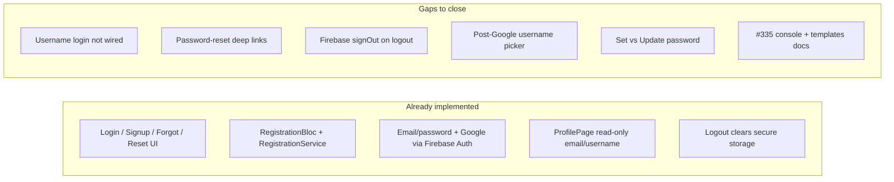
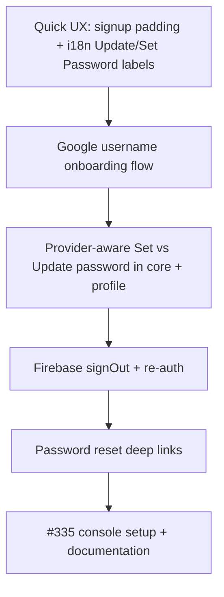

# Auth completion plan: #220, #335, and UX fixes

## Current state

Auth is **largely built** and gated by Remote Config `enable_user_accounts` ([`user_accounts_feature.dart`](apps/multichoice/lib/utils/user_accounts_feature.dart)).

| Area | Status |
|------|--------|
| Register page (email, username, password, signup) | Done |
| Login page (forgot password, sign-in, Google) | Done except username login |
| Forgot / reset password UI | Done; deep link + OOB flow incomplete |
| Registration bloc/repo/service | Done |
| Logout from profile | Done (local only) |
| Google sign-in | Done; auto-sets full Google `displayName` as username |
| Profile image | **Deferred** (follow-up ticket) |
| SMS MFA | **Deferred** |

---

## [#335 — Firebase Updates for Signup and Login](https://github.com/ZanderCowboy/multichoice/issues/335)

This ticket is primarily **Firebase Console configuration and documentation**, not new app code. Much of the DEV checklist already exists in [`docs/environment-config.md`](docs/environment-config.md).

### Console work (DEV + PROD)

For each project ([DEV `multichoice-app-develop`](https://console.firebase.google.com/u/0/project/multichoice-app-develop/overview), [PROD `multichoice-412309`](https://console.firebase.google.com/u/0/project/multichoice-412309/overview)):

1. **Sign-in methods** — Enable **Email/Password** and **Google** under Authentication → Sign-in method.
2. **SHA fingerprints** — Add debug + **release** SHA-1 and SHA-256 for each Android package (`co.za.zanderkotze.multichoice.dev` / `co.za.zanderkotze.multichoice`) via `.\gradlew signingReport` in `apps/multichoice/android`. PROD release SHA-1 is required for Play Store Google Sign-In ([Google client auth guide](https://developers.google.com/android/guides/client-auth)).
3. **Remote Config** — Set `enable_user_accounts` = `true` when ready to test/ship per environment.
4. **Email templates** (Authentication → Templates):
   - **Password reset** — Customize subject/body; note that in-app deep links also need `ActionCodeSettings` (see #220 gap below).
   - **Email verification** — Document decision: verification is already sent on email signup ([`registration_service.dart`](packages/core/lib/src/services/implementations/registration_service.dart) calls `sendEmailVerification()`), but the app does **not** block unverified users today. Recommend: keep sending, no enforcement until product asks for it.
5. **SMS MFA** — Out of scope; add a one-line note in docs that it was evaluated and deferred.

### Documentation deliverable

Add a short section to [`docs/environment-config.md`](docs/environment-config.md) (or a linked `docs/firebase-auth-setup.md`) titled **"Firebase Auth setup checklist (#335)"** with:

- Per-environment console links
- Sign-in method toggles
- SHA-1/256 steps for debug vs release
- Template customization notes
- Verification-email policy (send, don't enforce)
- MFA deferred

Close #335 when console is configured for both flavors and the doc is merged.

---

## [#220 — Implement Login Functionality](https://github.com/ZanderCowboy/multichoice/issues/220)

### Remaining app gaps (production hardening)

These are the main blockers before closing #220:

| Gap | Files | Fix |
|-----|-------|-----|
| **Password-reset deep links** | [`registration_service.dart`](packages/core/lib/src/services/implementations/registration_service.dart), app router, Android/iOS manifests | Follow existing plan [`.cursor/plans/password_reset_deep_links_cf7e5d35.plan.md`](.cursor/plans/password_reset_deep_links_cf7e5d35.plan.md): `ActionCodeSettings` on `sendPasswordResetEmail`, `app_links` listener, parse `oobCode` → `ResetPasswordPageRoute(oobCode: ...)`. |
| **Dev mock reset** | [`reset_password_bloc.dart`](packages/core/lib/src/application/reset_password/reset_password_bloc.dart) | Remove the 500ms fake-success path when `oobCode` is absent; show error or redirect to forgot-password. |
| **Firebase sign-out** | [`registration_service.dart`](packages/core/lib/src/services/implementations/registration_service.dart), [`profile_bloc.dart`](packages/core/lib/src/application/profile/profile_bloc.dart) | Add `signOut()` (Firebase Auth + `GoogleSignIn.signOut()`); call from logout. |
| **Username login** | [`registration_bloc.dart`](packages/core/lib/src/application/registration/registration_bloc.dart), [`login_page.dart`](apps/multichoice/lib/presentation/registration/login_page.dart) | UI accepts email **or** username via [`EmailOrUsernameField`](apps/multichoice/lib/presentation/registration/widgets/email_or_username_field.dart), but `_handleSignIn` always validates as email. **Recommend:** resolve username → email via stored mapping or Firebase lookup. Simplest v1: if input has no `@`, look up `lastUsedEmail` only when it matches — better v1: store `username → email` in secure storage at signup and resolve locally; document that cross-device username login needs Firestore (out of scope unless you want it). **Pragmatic close for #220:** change login field label to **Email only** and drop username validation, OR implement local username→email map from signup. |
| **Re-auth for password change** | `RegistrationService`, `ResetPasswordBloc` | Google-only users linking a password need `linkWithCredential`; password users changing password may hit `requires-recent-login`. Add re-auth prompt (current password or Google re-sign-in) before `updatePassword` / `linkWithCredential`. |

---

## Your additional items

### 1. Google sign-in: require username after signup

**Problem:** [`_signInWithGoogleViaFirebase`](packages/core/lib/src/services/implementations/registration_service.dart) stores Google `displayName` (e.g. `"John Smith"`) as `profile_username`.

**Recommended approach (no name/surname fields):**

- After successful Google sign-in, **do not** persist `displayName` as username.
- Set a flag in app storage, e.g. `needs_username_setup = true` (or leave `profile_username` empty).
- Show a **Set Username** screen/modal (reuse [`UsernameField`](apps/multichoice/lib/presentation/registration/widgets/username_field.dart) validation: min 2 chars) before navigating home.
- On submit: `user.updateDisplayName(chosenUsername)` + `ILoginService.storeUserProfile(username: ...)` + clear flag.
- Email/password signup unchanged (username collected on signup page).

**Do we need name and surname?** **No**, unless you need them for display/legal reasons elsewhere. Firebase/Google already have `displayName` internally; the app only needs a **public username** chosen by the user. Splitting first/last name adds fields, validation, and storage with no current consumer in the codebase.

### 2. Google users without a password: Set vs Update Password

Detect auth providers from `FirebaseAuth.instance.currentUser.providerData`:

| Providers | Profile label | Action |
|-----------|---------------|--------|
| `google.com` only (no `password`) | **Set Password** | `EmailAuthProvider.credential(email, newPassword)` → `user.linkWithCredential()` |
| Has `password` | **Update Password** | Existing `updatePassword` flow (+ re-auth) |

Implementation:

- Extend [`ProfileBloc`](packages/core/lib/src/application/profile/profile_bloc.dart) / `ProfileState` with `hasPasswordProvider` (or `canSetPassword`).
- [`profile_page.dart`](apps/multichoice/lib/presentation/profile/profile_page.dart): conditional `ListTile` title from i18n.
- [`reset_password_page.dart`](apps/multichoice/lib/presentation/registration/reset_password_page.dart): when `isChangePassword` and no password provider, route to link-password flow (no "current password" field needed for link).
- Rename all user-facing **"Change Password"** strings to **"Update Password"** for the password-provider case; add **"Set Password"** for Google-only.

i18n keys in [`en.i18n.json`](apps/multichoice/lib/i18n/en.i18n.json) / [`nl.i18n.json`](apps/multichoice/lib/i18n/nl.i18n.json):

- `profile.updatePassword` (replaces `changePassword` usages in UI)
- `profile.setPassword` (new)

Run `make slang` after edits.

### 3. Profile image — deferred

You chose to defer. When picked up later: reuse existing [`firebase_storage`](packages/core/pubspec.yaml) pattern from [`feedback_repository.dart`](packages/core/lib/src/repositories/implementation/feedback/feedback_repository.dart), add `image_picker`, Storage path `users/{uid}/avatar.jpg`, 48px `CircleAvatar` at top of [`profile_page.dart`](apps/multichoice/lib/presentation/profile/profile_page.dart). Track as a separate GitHub issue.

### 4. Sign-up page: Sign In button padding

In [`signup_page.dart`](apps/multichoice/lib/presentation/registration/signup_page.dart) app bar `actions`, the `TextButton` uses `padding: EdgeInsets.zero` inside a fixed `60×28` box — text is cramped on the right.

**Fix:** Add horizontal padding (e.g. `EdgeInsets.symmetric(horizontal: 8)`) and/or widen the `SizedBox` so "Sign In" has breathing room. Mirror in [`profile_button.dart`](apps/multichoice/lib/presentation/home/widgets/profile_button.dart) if the same pattern looks tight.

### 5. "Change Password" → "Update Password"

Covered above in i18n + profile/reset page titles. Update NL equivalent (`Wachtwoord bijwerken` or keep consistent with existing Dutch auth strings).

---

## Suggested implementation order

1. **Quick wins** — Sign-up padding; i18n rename; provider detection stub in profile.
2. **Google username flow** — Flag + modal/page + service changes.
3. **Set/Update password** — `linkWithCredential` vs `updatePassword` in `RegistrationService`.
4. **Logout/sign-out + re-auth** — Harden sensitive flows.
5. **Deep links** — Close forgot-password → app reset loop (#220 acceptance criteria).
6. **#335** — Console + doc (can run in parallel with 4–5).

---

## Testing

- `melos exec --scope=core -- flutter test` — registration, reset password, profile blocs; new link-password + signOut tests.
- `melos exec --scope=multichoice -- flutter analyze`
- Manual: Google sign-in → username prompt; profile shows Set Password; link password; label becomes Update Password; sign-up app bar padding; logout clears Google session; reset email opens app with `oobCode`.

---

## What closes each issue

| Issue | Close when |
|-------|------------|
| **#220** | Deep links work; dev mock removed; sign-out; username login resolved (or login field scoped to email); Google username + password flows done |
| **#335** | DEV+PROD console configured; templates set; auth setup doc merged; MFA noted as deferred |
