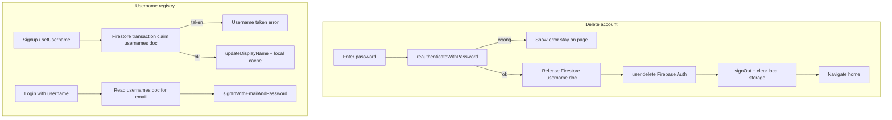

# Auth UX fixes: deletion, usernames, sign-in, email app

## What you observed (current behavior)

### Delete account

- **Not deleted on Firebase.** `[account_deletion_page.dart](apps/multichoice/lib/presentation/profile/account_deletion_page.dart)` only clears local secure storage (`deleteLoginInfo`) and pops to home. There is no `user.delete()`, no `signOut()`, and no backend queue.
- **Password is not verified.** The field uses `validatePolicy: false` (non-empty only). The TODO at line 43 is never implemented. Wrong password still “signs you out” locally because local tokens are cleared unconditionally.

### Username (`misgesteek`)

- **Firebase Console shows email, not username.** Usernames are stored as Firebase Auth `displayName` (see `[registration_service.dart](packages/core/lib/src/services/implementations/registration_service.dart)` `updateDisplayName`). There is no separate “username” field in the Auth user record UI.
- **Login alias is device-local today.** `[login_service.dart](packages/core/lib/src/services/implementations/login_service.dart)` keeps a `username_email_map` in secure storage. Username login resolves email from that map only — not from Firebase or any server.
- **No uniqueness checks.** `[credential_validation_service.dart](packages/core/lib/src/services/implementations/credential_validation_service.dart)` validates format only (min 2 chars).
- **“Account does not exist” with username + email:** If you sign in with username `misgesteek` on a device that never stored that mapping (new install, different phone, Google user before set-username), `[registration_bloc.dart](packages/core/lib/src/application/registration/registration_bloc.dart)` fails before Firebase with `'No account found for this username.'` — even though the email account exists in Firebase.

### Sign In button intermittent

- Sign In is hidden when `enable_user_accounts` Remote Config is `false` (`[profile_button.dart](apps/multichoice/lib/presentation/home/widgets/profile_button.dart)`).
- Default is `false` until fetch completes (`[firebase_service.dart](packages/core/lib/src/services/implementations/firebase_service.dart)`).
- Fetch runs **after first frame** in `[non_critical_services.dart](apps/multichoice/lib/app/bootstrap/non_critical_services.dart)`, but `**notifyRemoteConfigRefreshed()` is never called** on startup — only from debug tools. UI therefore often stays in the “flag off” state until an unrelated rebuild.

### Open Email App

- `[forgot_password_page.dart](apps/multichoice/lib/presentation/registration/forgot_password_page.dart)` uses `open_mail` and shows every app returned by `OpenMail.getMailApps()` with no filtering — Android can include non-mail apps that register mail intents.

---

## Target architecture




---

## 1. Delete account — immediate Firebase deletion

**Approach (per your choice):** Re-auth → release username → `user.delete()` → full local cleanup.

### Core (`packages/core`)

- Add `deleteAccount(String password)` to `[IRegistrationService](packages/core/lib/src/services/interfaces/i_registration_service.dart)` / `[RegistrationService](packages/core/lib/src/services/implementations/registration_service.dart)`:
  1. `reauthenticateWithPassword(password)` — reuse existing implementation (same pattern as `[reset_password_bloc.dart](packages/core/lib/src/application/reset_password/reset_password_bloc.dart)`)
  2. `releaseUsername(uid)` via new username repository (see section 2)
  3. `await _auth.currentUser?.delete()`
  4. `signOut()` (Firebase + Google + local) — reuse existing `[signOut](packages/core/lib/src/services/implementations/registration_service.dart)` rather than only `deleteLoginInfo`
- Expose via `[IRegistrationRepository](packages/core/lib/src/repositories/interfaces/registration/i_registration_repository.dart)`.
- Add `AccountDeletionBloc` (or extend `ProfileBloc` with `ProfileDeleteAccountRequested`) to keep UI thin — mirror reset-password error handling.

### App (`apps/multichoice`)

- Refactor `[account_deletion_page.dart](apps/multichoice/lib/presentation/profile/account_deletion_page.dart)` to dispatch bloc event instead of inline local-only logic.
- On wrong password: show localized error, **do not** clear session or navigate away.
- On success: `AuthNotifier.notifyAuthChanged()`, snackbar, `popUntilRoot`.
- Update copy in `[en.i18n.json](apps/multichoice/lib/i18n/en.i18n.json)` / `[nl.i18n.json](apps/multichoice/lib/i18n/nl.i18n.json)` — remove “request submitted / processed later” wording; state account is permanently deleted.

### Local storage cleanup

- Extend `[deleteLoginInfo](packages/core/lib/src/services/implementations/login_service.dart)` (or add `clearAllAuthLocalData`) to also delete `username_email_map` and `username_confirmed_user_ids` on account deletion / full sign-out.

### Tests

- `registration_service_test` / new `account_deletion_bloc_test`: wrong password blocks delete; success calls re-auth + delete + signOut (mock `FirebaseAuth`).

---

## 2. Firestore username registry

**Collection:** `usernames/{normalizedUsername}`  
**Document:** `{ uid, email, createdAt }` (username in doc ID = lowercase trimmed)

### Core

- New `IUsernameRepository` + `UsernameRepository` using existing `[FirebaseFirestore](packages/core/lib/src/injectable_module.dart)` injection (same pattern as `[feedback_repository.dart](packages/core/lib/src/repositories/implementation/feedback/feedback_repository.dart)`).
- Methods:
  - `Future<Either<AuthException, void>> claimUsername(String username, String uid, String email)` — Firestore **transaction**: fail if doc exists
  - `Future<String?> resolveEmailForUsername(String username)` — read doc
  - `Future<void> releaseUsername(String uid)` — delete doc where `uid` matches (query or store reverse map `user_usernames/{uid}`)
- Wire into:
  - `[signUp](packages/core/lib/src/services/implementations/registration_service.dart)` — after `createUserWithEmailAndPassword`, claim username before completing session
  - `[setUsername](packages/core/lib/src/services/implementations/registration_service.dart)` — claim before `updateDisplayName`
  - `[LoginService.resolveEmailForLogin](packages/core/lib/src/services/implementations/login_service.dart)` — try Firestore first; keep local map as offline cache fallback
- Add `validateUsernameAvailable` to registration/set-username blocs (debounced async check on blur/submit) using repository.

### Firestore rules (`[firebase/firestore.rules](firebase/firestore.rules)`)

```
match /usernames/{username} {
  allow read: if true;  // required for pre-auth username→email login
  allow create: if request.auth != null
    && request.resource.data.uid == request.auth.uid
    && !exists(/databases/$(database)/documents/usernames/$(username));
  allow delete: if request.auth != null && resource.data.uid == request.auth.uid;
  allow update: if false;
}
```

Document in `[docs/environment-config.md](docs/environment-config.md)` that username lookup exposes email (public identifier tradeoff). Optional follow-up: callable Cloud Function if you want to hide emails later.

### UI / i18n

- Show “Username already taken” on signup and set-username screens.
- Localize `'No account found for this username.'` via `[localize_core_message.dart](apps/multichoice/lib/i18n/localize_core_message.dart)`.

### Migration (existing accounts)

- On successful email/password sign-in, if user has `displayName` but no Firestore doc, attempt `claimUsername` (best-effort; skip if taken).
- No one-time admin script required for MVP.

### Tests

- Repository tests with `MockFirebaseFirestore` (transaction behavior mocked).
- Bloc tests: duplicate username on signup; username login resolves via repository.

---

## 3. Sign In button — Remote Config refresh

**Root fix:** Rebuild feature-flag consumers after startup fetch.

### Implementation

- Add a small `RemoteConfigActivationListener` widget in `[multichoice.dart](apps/multichoice/lib/app/view/multichoice.dart)` inside `MultiProvider` that:
  1. Awaits the same `initializeNonCriticalServices()` future (refactor `[bootstrap.dart](apps/multichoice/lib/app/bootstrap/bootstrap.dart)` to expose a single shared `Future`, avoid double-fetch)
  2. Calls `context.read<RemoteConfigDebugNotifier>().notifyRemoteConfigRefreshed()`
- Optionally show nothing extra in UI; `ProfileButton` already `watch`es the notifier.

### Tests

- Extend `[profile_button_test.dart](apps/multichoice/test/presentation/home/widgets/profile_button_test.dart)`: simulate RC refresh notification → Sign In appears when flag true.

---

## 4. Open Email App — filter picker

**Pragmatic fix without new dependency:** Client-side allowlist filter on `MailApp.name` (case-insensitive) for known mail clients: Gmail, Outlook, Yahoo Mail, Proton Mail, Spark, Edison, Blue Mail, Samsung Email, etc. If filter leaves 0 apps, fall back to unfiltered list + `mailto:` via existing `url_launcher`.

**File:** `[forgot_password_page.dart](apps/multichoice/lib/presentation/registration/forgot_password_page.dart)` — extract `_filterMailApps(List<MailApp>)`.

**Alternative (if allowlist still noisy):** Replace picker with `url_launcher` `mailto:` only (opens system default mail handler) — simpler UX, no app list.

---

## Validation checklist


| Area              | Command / check                                                                                      |
| ----------------- | ---------------------------------------------------------------------------------------------------- |
| Core unit tests   | `melos test:core`                                                                                    |
| App widget tests  | `melos test:multichoice`                                                                             |
| Analyze           | `melos exec --scope=core -- flutter analyze` + multichoice                                           |
| Manual — delete   | Wrong password → stay logged in; correct password → user gone in Firebase Console                    |
| Manual — username | Sign up `misgesteek` on device A; sign in with username on device B (fresh install)                  |
| Manual — sign in  | Cold start with RC `enable_user_accounts=true` → Sign In visible within ~1s                          |
| Manual — email    | Forgot password → Open Email App shows only mail clients                                             |
| Firebase          | Deploy updated `[firestore.rules](firebase/firestore.rules)` to DEV before testing username registry |


---

## Files to touch (primary)


| File                                                                                                                                         | Change                                        |
| -------------------------------------------------------------------------------------------------------------------------------------------- | --------------------------------------------- |
| `[account_deletion_page.dart](apps/multichoice/lib/presentation/profile/account_deletion_page.dart)`                                         | Bloc-driven delete with error handling        |
| New `account_deletion_bloc.dart` in core                                                                                                     | Re-auth + delete orchestration                |
| `[registration_service.dart](packages/core/lib/src/services/implementations/registration_service.dart)`                                      | `deleteAccount`, username claim/release hooks |
| New `username_repository.dart` in core                                                                                                       | Firestore registry                            |
| `[login_service.dart](packages/core/lib/src/services/implementations/login_service.dart)`                                                    | Firestore-first resolve; full local clear     |
| `[firebase/firestore.rules](firebase/firestore.rules)`                                                                                       | `usernames` collection rules                  |
| `[bootstrap.dart](apps/multichoice/lib/app/bootstrap/bootstrap.dart)` + `[multichoice.dart](apps/multichoice/lib/app/view/multichoice.dart)` | RC activation listener                        |
| `[forgot_password_page.dart](apps/multichoice/lib/presentation/registration/forgot_password_page.dart)`                                      | Mail app filtering                            |
| i18n JSON files                                                                                                                              | Updated delete + username-taken strings       |


