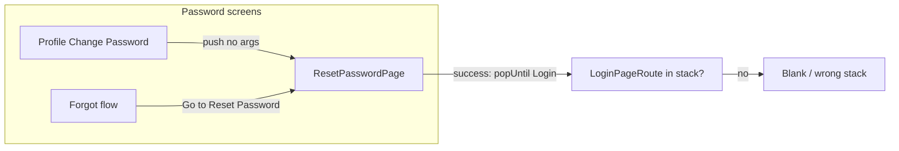

# Auth and profile UX — TODO backlog

## Context (what the code does today)

- Profile opens `[ResetPasswordPage](apps/multichoice/lib/presentation/registration/reset_password_page.dart)` via `[ResetPasswordPageRoute()](apps/multichoice/lib/presentation/profile/profile_page.dart)` with no arguments; the page always uses title **Reset Password**, primary **Reset Password**, **Back to Sign In**, and on success calls `popUntilRouteWithName(LoginPageRoute.name)` — which fails to find `LoginPageRoute` when that route is not in the stack (e.g. some forgot-password paths), yielding a **blank shell**.
- `[PasswordField](apps/multichoice/lib/presentation/registration/widgets/password_field.dart)` applies **policy-colored borders** whenever the field has text (`_policyBorderColor`), even when `showRequirements` is false and `validatePolicy` is false — so **sign-in** still shows strength styling while typing (the info tooltip is off, but the “requirements” feel is still there).
- `[RegistrationBloc._handlePrefill](packages/core/lib/src/application/registration/registration_bloc.dart)` loads `lastUsedEmail` for **both** login and signup when `[RegistrationEvent.prefillRequested()](packages/core/lib/src/application/registration/registration_event.dart)` runs — so **Sign Up** shows the previous account email after visiting login.
- `[SignupButton](apps/multichoice/lib/presentation/registration/widgets/signup_button.dart)` defaults to `enabled: true`; only **submit-time** `FormState.validate()` blocks submission — the button **stays tappable** with invalid password until press.
- `[AccountDeletionPage](apps/multichoice/lib/presentation/profile/account_deletion_page.dart)` has **no password** field; deletion is local sign-out + storage clear + snackbar (no re-auth yet).

---

## TODO list (implementation order is flexible)

| ID     | Task                                                                                                                                                                                                                                                                                                                                                                                                                                                                                                                                               | Primary files / notes                                                                                                                                                                                                                                                                                                                                                                                                                                                                                                                                                                                                                      |
| ------ | -------------------------------------------------------------------------------------------------------------------------------------------------------------------------------------------------------------------------------------------------------------------------------------------------------------------------------------------------------------------------------------------------------------------------------------------------------------------------------------------------------------------------------------------------- | ------------------------------------------------------------------------------------------------------------------------------------------------------------------------------------------------------------------------------------------------------------------------------------------------------------------------------------------------------------------------------------------------------------------------------------------------------------------------------------------------------------------------------------------------------------------------------------------------------------------------------------------ |
| **T1** | **Split “change password” vs “reset password” UX** — Add a route/page argument (e.g. `isLoggedInChangePassword` or `flow: change                                                                                                                                                                                                                                                                                                                                                                                                                   | reset`) to` [ResetPasswordPage](apps/multichoice/lib/presentation/registration/reset_password_page.dart)`and pass it from`[profile_page.dart](apps/multichoice/lib/presentation/profile/profile_page.dart)`vs forgot/debug entry points. **App bar**: “Change Password” when changing while logged in; “Reset Password” for forgot/unauthenticated reset. **Hide** “Back to Sign In” when in change-password mode. **Primary button** label: “Change Password” vs “Reset Password”. Regenerate router after changing`@RoutePage `args (`[app_router.gr.dart](apps/multichoice/lib/app/engine/app_router.gr.dart)` via build_runner/melos). |
| **T2** | **Success state in the primary button** — Reuse the pattern from `[ForgotPasswordPage](apps/multichoice/lib/presentation/registration/forgot_password_page.dart)` (`AsyncFilledButton` + `successLabel` / `successIcon`) on reset/change password so success feedback appears **in the button** before navigation.                                                                                                                                                                                                                                 | `reset_password_page.dart`, possibly `async_filled_button.dart` (only if a gap appears)                                                                                                                                                                                                                                                                                                                                                                                                                                                                                                                                                    |
| **T3** | **Wire change-password vs reset to real auth** — Today success is mocked (`Future.delayed`). For **change password** (logged in): Firebase `reauthenticate` + `updatePassword` (or your backend) when ready. For **reset link** flow: `confirmPasswordReset` / oob code — align with `[registration_backend_implementation](.cursor/plans/registration_backend_implementation_2def3781.plan.md)` if applicable.                                                                                                                                    | Core `IRegistrationRepository` / Firebase layer                                                                                                                                                                                                                                                                                                                                                                                                                                                                                                                                                                                            |
| **T4** | **Fix blank screen after reset** — Replace fragile `popUntilRouteWithName(LoginPageRoute.name)` with navigation that always lands on a defined screen: e.g. `**context.router.popUntilRoot()`** (user asked for **home**) or `popUntilRouteWithName(HomePageWrapperRoute.name)` so the root shell is visible. Optionally `maybePop` back into forgot flow when appropriate — product choice; **default to home** per request.                                                                                                                      | `reset_password_page.dart`                                                                                                                                                                                                                                                                                                                                                                                                                                                                                                                                                                                                                 |
| **T5** | **Sign-in: no strength/requirements UI while typing** — In `[PasswordField](apps/multichoice/lib/presentation/registration/widgets/password_field.dart)`, only apply **policy border coloring** (and any strength-only visuals) when `showRequirements                                                                                                                                                                                                                                                                                             |                                                                                                                                                                                                                                                                                                                                                                                                                                                                                                                                                                                                                                            |
| **T6** | **Sign up: clear previous account data** — On signup open: do **not** run the same prefill as login, or dispatch a **clear** event first. Options: (a) new `RegistrationEvent` e.g. `clearForm` / skip prefill for signup only; (b) call existing `[RegistrationCancelClicked](packages/core/lib/src/application/registration/registration_bloc.dart)` before prefill on `[SignupPage](apps/multichoice/lib/presentation/registration/signup_page.dart)`; (c) pass route flag into bloc. Ensure controllers reset to empty when bloc state clears. | `signup_page.dart`, `registration_bloc.dart`, tests in `[registration_bloc_test.dart](packages/core/test/src/application/registration/registration_bloc_test.dart)`                                                                                                                                                                                                                                                                                                                                                                                                                                                                        |
| **T7** | **Sign up: disable button until form is valid** — Derive validity: email (regex), username non-empty, password passes `[PasswordValidator](apps/multichoice/lib/presentation/registration/utils/password_validator.dart)` / bloc `IPasswordService`. Pass `enabled: isFormValid` into `[SignupButton](apps/multichoice/lib/presentation/registration/widgets/signup_button.dart)` (and keep loading/success behavior). Consider `onValidityChanged` on password + similar for email/username if needed.                                            | `signup_page.dart`, `signup_button.dart`                                                                                                                                                                                                                                                                                                                                                                                                                                                                                                                                                                                                   |
| **T8** | **Account deletion: password field** — Add obscured password field on `[AccountDeletionPage](apps/multichoice/lib/presentation/profile/account_deletion_page.dart)`; require match / non-empty before enabling “Request deletion”. If/when backend exists: **reauthenticate** with email+password before delete request.                                                                                                                                                                                                                           | `account_deletion_page.dart`, auth repository                                                                                                                                                                                                                                                                                                                                                                                                                                                                                                                                                                                              |
| **T9** | **Password manager / “save password” on re-login** — No `AutofillHints` / `AutofillGroup` in the project today (grep is empty). Wrap login (and signup/reset) form fields in `[AutofillGroup](https://api.flutter.dev/flutter/services/AutofillGroup-class.html)`, set `autofillHints` on email (`username`/`email`) and password fields (`password` vs `newPassword` on signup/reset). This is **best-effort**: OS and user settings control whether save/fill appears after logout.                                                              | `email_field.dart`, `email_or_username_field.dart`, `password_field.dart`, login/signup/reset pages                                                                                                                                                                                                                                                                                                                                                                                                                                                                                                                                        |

---

## Suggested sequencing

1. **Quick wins**: T5 (sign-in field), T4 (navigation), T6 (signup prefill).
2. **ResetPassword refactor**: T1 + T2, then T3 + T8 as auth backend allows.
3. **T7** after T6 so validation state isn’t fighting stale bloc email.
4. **T9** can be parallel with UI tasks; test on Android/iOS device.

## Testing

- Widget tests for `PasswordField` border behavior when `validatePolicy`/`showRequirements` false.
- Bloc tests for signup prefill vs clear.
- Manual: forgot-password → reset → lands on **home** with no blank route; profile → change password → titles/buttons/copy; signup after login shows **empty** fields.

