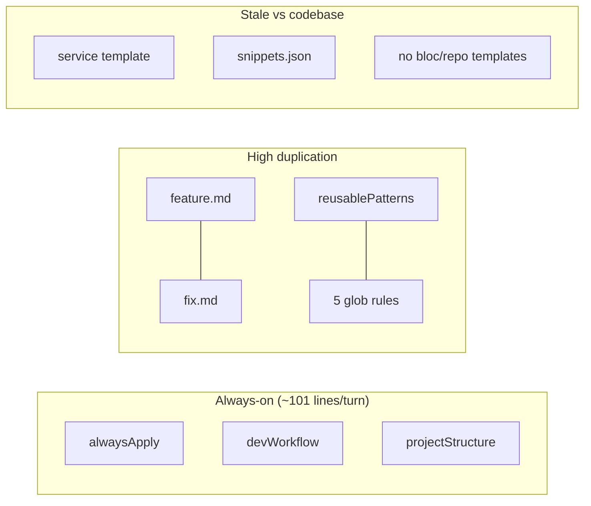

# Cursor Folder Overhaul

**Scope:** `.cursor/rules/`, `.cursor/commands/`, `.cursor/templates/`, `.cursor/references/`, `.cursor/agents/`, and [`.cursor/README.md`](.cursor/README.md). **Out of scope:** `skills/`, `plans/` (per request).

---

## Current state



**Pain points identified:**
- `feature.md` and `fix.md` share ~70% content (~250 duplicate lines)
- Three always-apply rules repeat validation, boundaries, and melos commands
- [`reusable-patterns.mdc`](.cursor/rules/reusable-patterns.mdc) duplicates 5 other rules + templates
- Templates use non-existent patterns (`Result<T>`, manual `injectable_module`, StatelessWidget-only pages)
- No `references/` or `agents/`; README links to missing `REUSABLE-CONTENT-GUIDE.md`
- Bloc pattern is **not Freezed** — uses sealed events, `@CopyWith()` + Equatable states, `@injectable` ([`profile_bloc.dart`](packages/core/lib/src/application/profile/profile_bloc.dart))
- Repos use `@LazySingleton(as: I*)` + `Either` from dartz ([`registration_repository.dart`](packages/core/lib/src/repositories/implementation/registration/registration_repository.dart))

---

## 1. Add `references/` (synthesized, token-efficient)

Create [`.cursor/references/README.md`](.cursor/references/README.md) as a short index. Each file targets **30–80 lines**, bullet-heavy, with links to fuller docs in [`docs/`](docs/) and root [`README.md`](README.md).

### Proposed structure

| File | Content source |
|------|----------------|
| [`product-overview.md`](.cursor/references/product-overview.md) | Root README, CONTRIBUTING — app purpose, monorepo map, shipped features |
| [`user-journeys/home-and-tabs.md`](.cursor/references/user-journeys/home-and-tabs.md) | Home layout, drawer, tabs, product tour enums |
| [`user-journeys/search-and-details.md`](.cursor/references/user-journeys/search-and-details.md) | Search bloc, details flow, add/edit dialogs |
| [`user-journeys/registration-and-profile.md`](.cursor/references/user-journeys/registration-and-profile.md) | Auth routes ([`app_router.dart`](apps/multichoice/lib/app/engine/app_router.dart)), `enable_user_accounts` flag, login modal, profile |
| [`user-journeys/feedback-and-settings.md`](.cursor/references/user-journeys/feedback-and-settings.md) | Feedback bloc, changelog, about/settings |
| [`architecture/layers-and-ownership.md`](.cursor/references/architecture/layers-and-ownership.md) | Distilled from rules — where UI vs core vs models live |
| [`architecture/feature-flags.md`](.cursor/references/architecture/feature-flags.md) | [`FirebaseConfigKeys`](packages/models/lib/src/enums/firebase/firebase_config_keys.dart), `IFirebaseService.isEnabled` pattern |
| [`architecture/codegen-and-di.md`](.cursor/references/architecture/codegen-and-di.md) | Melos/Makefile, injectable, copy_with_extension, mocks.dart |
| [`glossary.md`](.cursor/references/glossary.md) | Tab, entry, DTO, bloc, repository, wrapper — project terms |

**Design principle:** References are **on-demand context** (read when implementing features), not always-applied rules. Rules stay behavioral; references stay factual/product.

---

## 2. Add `agents/` subagents

Cursor subagents are markdown files in [`.cursor/agents/`](.cursor/agents/) with YAML frontmatter (`name`, `description`, `model`, `readonly`, `is_background`). Keep each agent **under 60 lines** of body text; point to rules/templates/references instead of inlining patterns.

### Proposed agents

| Agent file | `readonly` | Delegation trigger |
|------------|------------|-------------------|
| [`flutter-developer.md`](.cursor/agents/flutter-developer.md) | false | App UI in `apps/multichoice/lib/presentation`, layouts, auto_route pages, BlocProvider wiring, ui_kit/theme |
| [`architecture-engineer.md`](.cursor/agents/architecture-engineer.md) | false | New services/repos/blocs, package boundaries, DI, models in `packages/models`, cross-package contracts |
| [`testing-engineer.md`](.cursor/agents/testing-engineer.md) | false | `bloc_test`, widget tests, mocks.dart, Isar test setup, melos test targets |
| [`reviewer.md`](.cursor/agents/reviewer.md) | **true** | Pre-PR review: scope, regressions, architecture drift, missing tests |
| [`firebase-specialist.md`](.cursor/agents/firebase-specialist.md) | false | Remote Config flags, Auth, Firestore feedback, Firebase functions touchpoints |

Each agent body will include:
- 3–5 step workflow (read nearby code → follow `.cursor/rules` + `.cursor/templates` → validate)
- Explicit package paths and canonical examples (`profile`, `registration`)
- `model: inherit` default; reviewer may use `fast` for cost savings

Add a one-line note in [`.cursor/README.md`](.cursor/README.md) explaining agents are auto-delegated via `description` or invokable by name.

---

## 3. Refactor commands (token reduction)

### 3a. Extract shared workflow base

Create [`.cursor/commands/_workflow-base.md`](.cursor/commands/_workflow-base.md) (~35 lines) containing shared steps only:
- Read relevant `.cursor/rules` (list rule filenames, not full content)
- Read `.cursor/references` when product/UX context needed
- Inspect nearby code before editing
- Mocks/codegen via Melos (`make db`); see `development-workflow.mdc`
- Validation: narrowest melos test + scoped analyze first
- No commit/push unless asked; confirmation gates for deps/architecture

### 3b. Slim command files

| File | Target | Change |
|------|--------|--------|
| [`feature.md`](.cursor/commands/feature.md) | ~45 lines | "Include `_workflow-base`" + ticket fetch + feature-specific steps (UX parity, tests for new behavior) |
| [`fix.md`](.cursor/commands/fix.md) | ~40 lines | Base + reproduce/root-cause/minimal-change rules only |
| [`test.md`](.cursor/commands/test.md) | ~12 lines | Pointer to `testing-rules.mdc`, `templates/bloc-test-template.dart`, melos test commands |
| [`commit.md`](.cursor/commands/commit.md) | ~45 lines | Replace 14 feature-specific groups with 6 layers: platform, models, core (bloc/repo/service), app UI, tests, chore/config. "Most specific path wins." |
| [`create-pr.md`](.cursor/commands/create-pr.md) | ~35 lines | Keep project-specific: draft, `develop` base, `ZanderCowboy`, label list, title format. Drop duplicate `gh` examples (user rules cover mechanics) |
| [`changelog.md`](.cursor/commands/changelog.md) | unchanged | Already minimal |

**Estimated savings:** ~1,200–1,500 tokens per `feature`/`fix` invocation; ~400 per `commit` invocation.

---

## 4. Refactor rules (token reduction)

### Target architecture

| Rule | `alwaysApply` | Role after refactor |
|------|---------------|---------------------|
| [`always-apply.mdc`](.cursor/rules/always-apply.mdc) | true | **~12 lines:** scope, confirmation gates, secrets, no commit — remove Validation section |
| [`development-workflow.mdc`](.cursor/rules/development-workflow.mdc) | true | **~30 lines:** melos/make commands, codegen, validation (single source) |
| [`project-structure.mdc`](.cursor/rules/project-structure.mdc) | true | **~18 lines:** package ownership + boundaries only — drop Required Patterns (moved to api-rules) |
| [`code-organization.mdc`](.cursor/rules/code-organization.mdc) | glob | Folder map only — drop export.dart/part (one home in ui-rules) |
| [`api-rules.mdc`](.cursor/rules/api-rules.mdc) | glob | Interfaces, `@LazySingleton`, Either/errors, models — drop Tests section |
| [`ui-rules.mdc`](.cursor/rules/ui-rules.mdc) | glob | Page structure, constants paths — **remove inline Dart code block** (~15 lines) |
| [`testing-rules.mdc`](.cursor/rules/testing-rules.mdc) | glob | Structure + mocks path — drop Validation (one-liner → workflow rule) |
| [`reusable-patterns.mdc`](.cursor/rules/reusable-patterns.mdc) | **delete** | Replace with 5-line stub or remove; patterns live in templates + references |

**Estimated savings:** ~200–400 tokens every turn from slimmer always-apply trio; ~300 when glob rules match.

---

## 5. Update templates to match codebase

Rename `example-*` → canonical names (update README and any rule references).

### Templates to add

| New file | Based on |
|----------|----------|
| [`bloc-template/`](.cursor/templates/) or single `bloc-template.dart` with file-boundary comments | [`profile_bloc.dart`](packages/core/lib/src/application/profile/profile_bloc.dart) + event/state parts |
| [`repository-interface-template.dart`](.cursor/templates/repository-interface-template.dart) | [`i_registration_repository.dart`](packages/core/lib/src/repositories/interfaces/registration/i_registration_repository.dart) |
| [`repository-implementation-template.dart`](.cursor/templates/repository-implementation-template.dart) | [`registration_repository.dart`](packages/core/lib/src/repositories/implementation/registration/registration_repository.dart) |
| [`bloc-test-template.dart`](.cursor/templates/bloc-test-template.dart) | [`profile_bloc_test.dart`](packages/core/test/src/application/profile/profile_bloc_test.dart) |
| [`repository-test-template.dart`](.cursor/templates/repository-test-template.dart) | Registration repo delegation test pattern |

**Bloc template must reflect:**
- `part` files for event/state/g.dart
- Sealed `ProfileEvent` + `final class` variants (not Freezed)
- `@CopyWith()` + `Equatable` state with `.initial()` factory
- `@injectable` bloc with `switch` event handling
- Export note: add to `packages/core/lib/src/application/export.dart`

### Templates to fix

| File | Fixes |
|------|-------|
| [`service-template.dart`](.cursor/templates/example-service-template.dart) | Split interface (`i_*_service.dart`) and impl; `@LazySingleton(as: I*)`; remove `Result<T>` and `injectable_module` block; match [`app_storage_service.dart`](packages/core/lib/src/services/implementations/app_storage_service.dart) |
| [`page-template.dart`](.cursor/templates/example-page-template.dart) | `@RoutePage()`, optional `StatefulWidget` + manual `coreSl<Bloc>()` pattern from [`profile_page.dart`](apps/multichoice/lib/presentation/profile/profile_page.dart); imports for auto_route, flutter_bloc, core |
| [`test-template.dart`](.cursor/templates/example-test-template.dart) | Generic `group`/`setUp`/`tearDown` kept; add comment pointing to bloc-test-template for blocs |
| [`freezed-model-template.dart`](.cursor/templates/example-freezed-model-template.dart) | Minor: note models live under `packages/models/lib/src/` with correct part paths |
| [`snippets.json`](.cursor/templates/example-snippets.json) | Update service/page snippets to match fixed templates OR trim to 3 snippets (service, page, bloc) and remove outdated `Result` usage |

---

## 6. Update README

Rewrite [`.cursor/README.md`](.cursor/README.md) as a **~40-line index**:

```text
.cursor/
├── agents/       # Subagent definitions (auto-delegation)
├── commands/     # Slash commands (_workflow-base is internal)
├── references/   # Product + journey context (on-demand)
├── rules/        # Behavioral constraints
└── templates/    # Canonical code scaffolds
```

- Remove broken `REUSABLE-CONTENT-GUIDE.md` link
- Remove verbose glob examples and plan-authoring guide (plans ignored)
- Add "when to read references vs rules" one-liner

---

## 7. Validation after implementation

- Grep `.cursor/` for stale `example-` paths and `REUSABLE-CONTENT-GUIDE` references
- Spot-check one agent description triggers sensible delegation
- No melos/analyze required (markdown-only changes)

---

## Token impact summary

| Area | Before (approx) | After (approx) | When paid |
|------|-----------------|----------------|-----------|
| Always-apply rules | ~101 lines | ~60 lines | Every turn |
| feature + fix commands | ~250 lines | ~90 lines | Per invocation |
| reusable-patterns | 42 lines | 0 (deleted) | When globs match |
| commit command | 105 lines | ~45 lines | Per invocation |
| README | 186 lines | ~40 lines | When read |

**Net:** Lower baseline context cost + less duplication when commands/rules/templates overlap.
