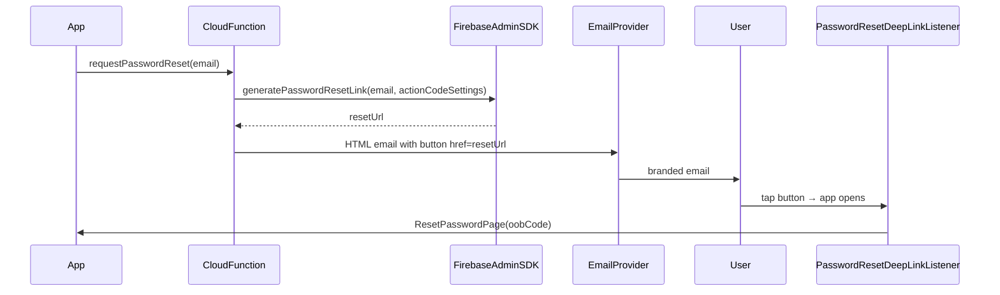

# Custom HTML password-reset email with button

## Key constraint

Firebase Console templates (**Authentication → Templates → Password reset**) are **plain text only** — no HTML, no styled buttons. Your repo already documents this in `[docs/password-reset-deep-links.md](docs/password-reset-deep-links.md)`.

For a real **Reset Password** button, you must **stop using client-side** `FirebaseAuth.sendPasswordResetEmail()` and instead:

1. Generate the link with **Firebase Admin SDK** (`generatePasswordResetLink`)
2. Send your own **HTML email** from a **Cloud Function**

The link itself stays a valid Firebase action link (`mode=resetPassword`, `oobCode=…`), so your existing deep-link flow keeps working:




---

## What you already have (reuse, don’t rebuild)


| Piece                    | Location                                                                                                                                                                                                                 | Role                                                                                                |
| ------------------------ | ------------------------------------------------------------------------------------------------------------------------------------------------------------------------------------------------------------------------ | --------------------------------------------------------------------------------------------------- |
| Reset email trigger (UI) | `[forgot_password_page.dart](apps/multichoice/lib/presentation/registration/forgot_password_page.dart)`                                                                                                                  | Calls `IRegistrationRepository.sendPasswordResetEmail` — **no UI change needed**                    |
| Service seam             | `[registration_service.dart](packages/core/lib/src/services/implementations/registration_service.dart)`                                                                                                                  | Today calls `_auth.sendPasswordResetEmail` with `ActionCodeSettings` — **swap implementation here** |
| Deep-link handling       | `[password_reset_deep_link_listener.dart](apps/multichoice/lib/app/view/auth/password_reset_deep_link_listener.dart)` + `[password_reset_link_parser.dart](packages/core/lib/src/utils/password_reset_link_parser.dart)` | Parses `oobCode` — **unchanged**                                                                    |
| Functions + nodemailer   | `[functions/src/index.ts](functions/src/index.ts)`                                                                                                                                                                       | Gmail transporter pattern from feedback emails — **extend with a callable**                         |
| Auth domain config       | `[auth_environment.dart](packages/core/lib/src/config/auth_environment.dart)`                                                                                                                                            | `AUTH_DOMAIN` → continue URL — **mirror on the server**                                             |
| Hosting / App Links      | `[firebase/public/.well-known/assetlinks.json](firebase/public/.well-known/assetlinks.json)`                                                                                                                             | Link verification — **unchanged**                                                                   |


---

## Architecture

### 1. Cloud Function (new callable)

Add `sendPasswordResetEmail` (or `requestPasswordReset`) in `[functions/src/index.ts](functions/src/index.ts)`:

```typescript
import { onCall, HttpsError } from "firebase-functions/v2/https";

export const sendPasswordResetEmail = onCall(
  { region: "europe-west1", secrets: [emailUser, emailPass] },
  async (request) => {
    const email = String(request.data?.email ?? "").trim().toLowerCase();
    if (!email) throw new HttpsError("invalid-argument", "Email required");

    const actionCodeSettings = {
      url: `https://${authDomain.value()}`,       // defineString per DEV/PROD
      handleCodeInApp: true,
      android: { packageName: androidPackage.value(), installApp: true },
      iOS: { bundleId: iosBundleId.value() },
    };

    let resetLink: string;
    try {
      resetLink = await admin.auth().generatePasswordResetLink(email, actionCodeSettings);
    } catch (e: any) {
      // Match Firebase client behavior: don't reveal whether the account exists
      if (e.code === "auth/user-not-found") return { ok: true };
      throw new HttpsError("internal", "Could not send reset email");
    }

    await createTransporter().sendMail({
      from: `"Multichoice" <${emailUser.value()}>`,
      to: email,
      subject: "Reset your Multichoice password",
      html: buildResetEmailHtml(resetLink),  // button lives here
    });

    return { ok: true };
  },
);
```

**HTML button template** (inline styles for email-client compatibility):

```html
<p>Hello,</p>
<p>Tap the button below to reset your password. This link expires soon.</p>
<p style="text-align:center;margin:32px 0;">
  <a href="{{resetLink}}"
     style="background:#039be5;color:#fff;padding:14px 28px;
            border-radius:6px;text-decoration:none;font-weight:600;">
    Reset Password
  </a>
</p>
<p>If you didn't request this, ignore this email.</p>
```

Extract `buildResetEmailHtml` to a small `functions/src/email/reset_password_email.ts` if the template grows.

### 2. Function environment params (DEV + PROD)

Add `defineString` params alongside existing `EMAIL_USER` / `EMAIL_PASS`:

- `AUTH_DOMAIN` — same value as app dart-define (e.g. your Hosting custom domain)
- `ANDROID_PACKAGE_NAME` — `co.za.zanderkotze.multichoice.dev` / `.multichoice`
- `IOS_BUNDLE_ID` — matching bundle IDs

Set per project in Firebase Console → Functions → Configuration (or `firebase functions:config` / params deploy flow you already use for feedback).

**Authorized domains** in Firebase Console must still include the `AUTH_DOMAIN` host (already required for deep links).

### 3. App change (core package only)

In `[registration_service.dart](packages/core/lib/src/services/implementations/registration_service.dart)`, replace the `_auth.sendPasswordResetEmail(...)` block with a callable:

- Add `cloud_functions: ^5.x` to `[packages/core/pubspec.yaml](packages/core/pubspec.yaml)` (align with your `firebase_core` ^4.x stack)
- Call `FirebaseFunctions.instanceFor(region: 'europe-west1').httpsCallable('sendPasswordResetEmail').call({'email': email.trim()})`
- Map `FirebaseFunctionsException` to existing `AuthException` types
- **Remove** client-side `sendPasswordResetEmail` so Firebase does not send its default plain-text email too

No changes needed in `[forgot_password_page.dart](apps/multichoice/lib/presentation/registration/forgot_password_page.dart)` or repository interface.

### 4. Email provider choice


| Option                            | Effort | Deliverability                            | Recommendation                                        |
| --------------------------------- | ------ | ----------------------------------------- | ----------------------------------------------------- |
| **Gmail + nodemailer** (existing) | Low    | Poor for bulk/transactional; daily limits | Fine for **DEV / internal testing**                   |
| **SendGrid / Resend / Postmark**  | Medium | Good with custom domain DNS               | **PROD** — set SPF, DKIM, DMARC on your sender domain |


For PROD, send from something like `noreply@stackmint.app` (or your brand domain) via a transactional provider instead of a personal Gmail inbox. The function code stays the same — only transporter config changes.

### 5. Security hardening (recommended)

- **App Check**: enforce on the callable (you already have `firebase_app_check` in the app) so only your app can trigger resets
- **Generic success response** even when `auth/user-not-found` (shown above) — prevents email enumeration
- **Rate limiting**: rely on Firebase callable quotas + optional Firestore counter per email/IP if abuse appears
- **Secrets**: keep `EMAIL_PASS` / API keys in Firebase secrets, not in repo (you already follow this for feedback)

### 6. What does *not* change the email

A **custom action handler page** on Hosting ([Firebase docs](https://firebase.google.com/docs/auth/custom-email-handler)) only styles the **web fallback page** after the link is opened in a browser — it does **not** change the email body. Skip this unless you also want a branded web fallback when the app is not installed.

---

## Firebase Console checklist (both DEV + PROD)

1. **Authentication → Sign-in method** — Email/Password enabled
2. **Authentication → Settings → Authorized domains** — include your `AUTH_DOMAIN`
3. **Authentication → Templates** — optional cleanup; once the app uses the callable, the built-in template is unused for this flow
4. **Functions** — deploy callable; set `EMAIL_USER`, `EMAIL_PASS`, `AUTH_DOMAIN`, package/bundle params
5. **App Check** — register app + enforce on the callable
6. **Hosting** — `assetlinks.json` deployed (already documented in `[docs/password-reset-deep-links.md](docs/password-reset-deep-links.md)`)

---

## Testing plan

1. **Function unit test** — mock `admin.auth().generatePasswordResetLink` and nodemailer; assert HTML contains the link and button text
2. **Update** `[registration_service` tests](packages/core/test/) — verify callable is invoked instead of `FirebaseAuth.sendPasswordResetEmail`
3. **Manual E2E (DEV flavor)**:
  - Trigger forgot-password from app
  - Confirm HTML email arrives with button (not Firebase default template)
  - Tap button on Android → app opens → `ResetPasswordPage` → new password → login
4. **Spam check** — if using Gmail in DEV, check Promotions/Spam; PROD provider should improve this

---

## Documentation update

Extend the **"If you need a real button"** section in `[docs/password-reset-deep-links.md](docs/password-reset-deep-links.md)` with the concrete callable + env-param setup so future you doesn’t have to rediscover the Admin SDK path.

---

## Rollout strategy

1. Implement callable + DEV params; wire `RegistrationService` to callable
2. Test deep links on DEV Android build
3. Switch PROD to transactional email provider + branded sender domain
4. Deploy function to PROD; smoke-test one real reset

No feature flag is strictly required, but you could gate the callable behind Remote Config `use_custom_reset_email` during rollout if you want a quick rollback to client-side Firebase email.