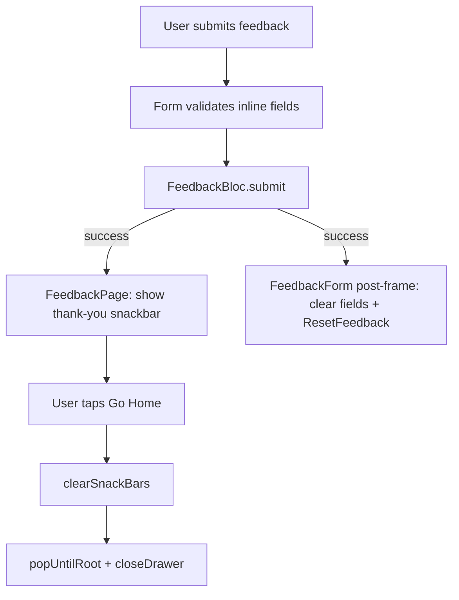

# Feedback Form UX Improvements

## Scope

All changes are localized to the feedback presentation layer plus i18n strings. One new dependency (`super_clipboard`) for screenshot paste, per your choice.

Primary files:
- [`apps/multichoice/lib/presentation/feedback/widgets/feedback_form.dart`](apps/multichoice/lib/presentation/feedback/widgets/feedback_form.dart)
- [`apps/multichoice/lib/presentation/feedback/feedback_page.dart`](apps/multichoice/lib/presentation/feedback/feedback_page.dart)
- [`apps/multichoice/lib/i18n/en.i18n.json`](apps/multichoice/lib/i18n/en.i18n.json)

Existing patterns to reuse:
- Top-aligned multiline fields: [`reusable_form.dart`](apps/multichoice/lib/presentation/shared/widgets/forms/reusable_form.dart) uses `textAlignVertical: TextAlignVertical.top` + `alignLabelWithHint: true`
- Inline validation: registration fields use `_hasTyped` + `AutovalidateMode.onUserInteraction` (e.g. [`email_field.dart`](apps/multichoice/lib/presentation/registration/widgets/email_field.dart))
- Email regex: same as [`CredentialValidationService`](packages/core/lib/src/services/implementations/credential_validation_service.dart) — optional for feedback (empty = valid)
- Snackbar cleanup on navigation: same as [`data_transfer_page.dart`](apps/multichoice/lib/presentation/shared/data_transfer/data_transfer_page.dart) (`clearSnackBars()` before pop)



---

## 1. Clipboard screenshot paste

**Dependency:** Add `super_clipboard` to [`apps/multichoice/pubspec.yaml`](apps/multichoice/pubspec.yaml).

**UI:** When `feedback_images_enabled` is on, show a second button beside the existing "Add Images" button:
- **Add Images** — unchanged (`FilePicker`)
- **Paste screenshot** — new (`_pasteImageFromClipboard`)

**Implementation in `feedback_form.dart`:**
- Read clipboard via `SystemClipboard.instance?.read()`
- Check `reader.canProvide(Formats.png)` (fallback to `Formats.jpeg` if needed)
- Read bytes, wrap in `PlatformFile(name: 'screenshot_${timestamp}.png', bytes: ..., size: ...)`
- Dispatch existing `FeedbackEvent.imageAdded(file)` — no bloc/repository changes needed
- If clipboard has no image, show a brief snackbar using a new i18n string (e.g. `feedback.noImageInClipboard`)

Keep the image section behind the existing Remote Config flag.

---

## 2. Inline email validation

Replace the current `@`-only check in the email `TextFormField`:

```dart
// current — too weak
if (!value.contains('@')) { ... }
```

**New behavior (optional field):**
- Add `_hasTypedEmail` state flag
- Set `autovalidateMode: _hasTypedEmail ? AutovalidateMode.onUserInteraction : AutovalidateMode.disabled`
- Validator: return `null` if trimmed empty; otherwise validate with the same regex as `CredentialValidationService` (inline regex, no service change — feedback email is optional unlike registration)
- Flip `_hasTypedEmail` on first non-empty input in `onChanged`

---

## 3. Required field indicators

Append ` *` to labels for required fields only:
- **Category** — required (validator already enforces)
- **Your Feedback** — required
- **Rating** — add a small label above the star row (currently unlabeled); e.g. `Rating *`

Leave **Email (optional)** unchanged — no asterisk.

Add i18n keys rather than hardcoding asterisks in Dart where practical (e.g. `categoryLabelRequired`, `messageLabelRequired`, `ratingLabel`).

---

## 4. Top-align "Your Feedback" text

On the message `TextFormField`:
- `textAlignVertical: TextAlignVertical.top`
- `decoration: InputDecoration(alignLabelWithHint: true, ...)`

Matches the pattern already used for title/subtitle fields in the app.

---

## 5. Category-specific helper text

Add i18n hints under `feedback.messageHints`:

| Category | Hint (draft) |
|----------|--------------|
| Bug Report | Describe what happened, steps to reproduce, and when it occurs. |
| Feature Request | Describe the feature you want and how it would help you. |
| General Feedback | Share your overall thoughts about the app. |
| UI/UX | Describe layout, navigation, or design issues. |
| Performance | Slow app, crashing, freezing, battery drain, etc. |

In `feedback_form.dart`, derive `hintText` from `state.feedback.category` via a small private helper mapping category display string → i18n hint. Update hint when category dropdown changes (reactive via `BlocBuilder`).

Also fix the category dropdown to use `value:` instead of `initialValue:` so it resets correctly after submit (see below).

---

## 6. Clear form after successful submit

**Problem:** Controllers and bloc state persist after submit; `FeedbackEvent.reset()` exists but is never called from UI.

**Approach:** Add a `BlocListener` inside `_FeedbackFormBody` with:
```dart
listenWhen: (prev, curr) => !prev.isSuccess && curr.isSuccess
```

In the listener, schedule reset in a post-frame callback (avoids racing the page-level success snackbar listener):
- Clear `_messageController` and `_emailController`
- `_formKey.currentState?.reset()`
- Reset `_hasTypedEmail = false`
- Dispatch `FeedbackEvent.reset()` to clear category, rating, and attached images

Switch dropdown from `initialValue` to `value: state.feedback.category` so the UI reflects bloc reset.

---

## 7. Dismiss snackbar when navigating home

**Problem:** Success snackbar is shown on the root `ScaffoldMessenger`. After `popUntilRoot()`, it persists on the home screen.

**Fix in [`feedback_page.dart`](apps/multichoice/lib/presentation/feedback/feedback_page.dart):**
- In the snackbar **Go Home** action: call `messenger.clearSnackBars()` before `popUntilRoot()`
- In the app bar **Home** button handler: same `clearSnackBars()` before navigation
- Optionally clear snackbars in the back handler too for consistency with `DataTransferScreen`

---

## i18n additions

Extend [`en.i18n.json`](apps/multichoice/lib/i18n/en.i18n.json) `feedback` section with:
- Required labels / rating label
- `pasteScreenshot`, `noImageInClipboard`
- `messageHints.*` per category

Run slang codegen after editing (`melos` / existing i18n workflow).

---

## Validation

- `melos exec --scope=multichoice -- flutter analyze`
- Manual smoke test on feedback page:
  - Paste screenshot (desktop + one mobile target if available)
  - Email validates inline after typing (valid/invalid/empty)
  - Required asterisks visible; category hint updates on selection
  - Message text starts at top of field
  - After submit: form clears; thank-you snackbar shows
  - Tap Go Home: snackbar gone on home screen

No new bloc tests required unless reset-on-success logic moves into the bloc (it stays in UI).
