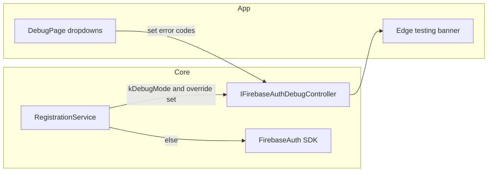

# Firebase Auth debug exception overrides

## Why not a true Firebase "interceptor"

`FirebaseAuth` is a concrete SDK type registered in `[injectable_module.dart](packages/core/lib/src/injectable_module.dart)`. There is no supported hook to intercept all calls globally. The practical approach that matches your goal ("no actual call" + same `AuthException` messages as production) is to **short-circuit inside `[RegistrationService](packages/core/lib/src/services/implementations/registration_service.dart)`** before `createUserWithEmailAndPassword`, `signInWithEmailAndPassword`, or `signInWithCredential` (Google path), using the **same mapping** as today via `[_mapFirebaseAuthError](packages/core/lib/src/services/implementations/registration_service.dart)` and a synthetic `FirebaseAuthException(code: ..., message: 'debug')`.

## 1. Core: debug controller interface + implementation

- Add something like `IFirebaseAuthDebugController` in `[packages/core/lib/src/services/interfaces/](packages/core/lib/src/services/interfaces/)` (or a small `debug/` subfolder if you prefer grouping) with:
  - **Sign-up override**: nullable `String?` Firebase error code (or enum that maps to codes).
  - **Sign-in override**: nullable `String?` (covers email/password and optionally Google credential flow—see below).
  - Methods: `setSignUpOverride`, `setSignInOverride`, `clearAll`, and getters for whether anything is active.
  - Extend `**ChangeNotifier`** so the app can rebuild the edge banner when selection changes.
- Register as `@LazySingleton(as: IFirebaseAuthDebugController)` and export via `[packages/core/lib/core.dart](packages/core/lib/core.dart)` (or services export).

**Codes to expose in the UI** should align with `[_mapFirebaseAuthError](packages/core/lib/src/services/implementations/registration_service.dart)` (e.g. `wrong-password`, `email-already-in-use`, `weak-password`, `user-not-found`, `invalid-email`, `user-disabled`, `operation-not-allowed`, `invalid-credential`, `invalid-login-credentials`, plus a catch-all using raw `message`/`code` if useful).

## 2. Core: wire `RegistrationService`

- Inject `IFirebaseAuthDebugController` as a **fourth** constructor parameter.
- At the **start** of `signUp` / `signIn` / `_signInWithGoogleViaFirebase` (only the branch that calls `_auth.signInWithCredential`):
  - If `**kDebugMode`** and the relevant override is non-null, return  
  `Left(AuthException.firebaseMessage(_mapFirebaseAuthError(FirebaseAuthException(code: override, message: 'debug'))))`  
  and **do not** call Firebase (or Google Sign-In for that path when simulating the Firebase credential step).
- **Release builds**: `kDebugMode` is false, so Firebase is always called; the controller state is irrelevant.

**Google sign-in nuance**: Today the flow runs `googleSignIn.signIn()` before Firebase. To avoid real Google UI when testing Firebase errors, you can either:

- **Phase 1 (minimal)**: Only short-circuit **after** Google returns tokens, right before `signInWithCredential` (tests Firebase mapping without hitting Firebase; Google picker may still appear), or
- **Stronger**: If a Google/Firebase override is set, skip Google and return the synthetic error immediately (fully offline for that test). Recommend documenting this choice in code comments; the stronger option matches "no external calls" better for the credential step.

## 3. App: Debug page UI

- Extend `[DebugView](apps/multichoice/lib/presentation/debug/widgets/debug_option_selector.dart)` with a new tab (e.g. **External / Auth testing**) **or** add a **section** under existing `[DebugToolsContent](apps/multichoice/lib/presentation/debug/widgets/debug_tools_content.dart)` to avoid tab proliferation—your call; a dedicated sub-tab keeps "Firebase Auth" isolated.
- Widget: two **dropdowns** (or one list + labels): **Sign up simulation** and **Sign in simulation**, each with **None** + the code list above.
- Use `coreSl<IFirebaseAuthDebugController>()` and `ListenableBuilder` (or `Provider` if you already prefer it) so changes apply immediately.
- Optional: **Clear overrides** button calling `clearAll()`.

Guard with `**kDebugMode`** (same as `[DebugPage](apps/multichoice/lib/presentation/debug/debug_page.dart)`); the route is already unreachable in release.

## 4. App: edge "Testing" label

- In `[Multichoice](apps/multichoice/lib/app/view/multichoice.dart)` `MaterialApp.router` **builder**, wrap the existing `ColoredBox` child in a `**Stack`**:
  - Base: current `child`.
  - Overlay: `**ListenableBuilder`** listening to `coreSl<IFirebaseAuthDebugController>()`; when `isActive` (any override), show a small `**Positioned`** strip (e.g. top-right or right edge rotated text) with label like **"Auth override"** or **"Testing"**, styled with `Theme` / `ui_kit` tokens.
- Only show when `**kDebugMode && controller.isActive`**.

## 5. Tests and codegen

- Add `MockSpec<IFirebaseAuthDebugController>` to `[packages/core/test/mocks.dart](packages/core/test/mocks.dart)`, run `**melos`** / build_runner for mocks per project rules.
- Update `[registration_service_test.dart](packages/core/test/src/services/registration_service_test.dart)`: pass a mock controller; default stub = no override; add 1–2 tests proving **when override is set, Firebase is never called** and the **Left** matches the mapped message for a known code (e.g. `wrong-password`).
- Run injectable codegen after changing `[RegistrationService](packages/core/lib/src/services/implementations/registration_service.dart)` constructor (`[get_it_injection.config.dart](packages/core/lib/src/get_it_injection.config.dart)` will update).

## 6. Scope and safety

- No changes to production auth semantics when not in debug mode.
- Keep the diff focused: avoid refactoring unrelated auth code; optional extraction of `_mapFirebaseAuthError` to a shared helper is only worthwhile if it removes duplication—otherwise keep mapping in one class.

