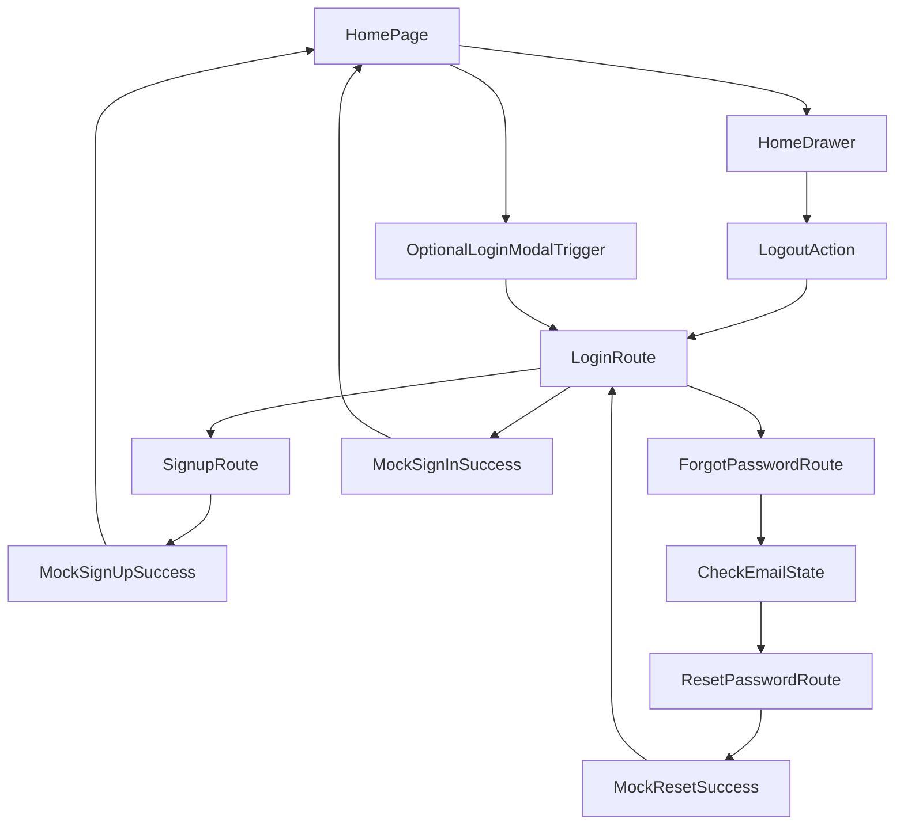

# Frontend Auth UX Implementation Plan

## Scope

Implement complete frontend-only auth UX in the Flutter app with:

- Register screen (email, username, password + password rule validation, signup action)
- Login screen (email-or-username, password, forgot password, sign in, navigate to signup)
- Forgot password flow (email entry/prepopulate + check-email feedback)
- Reset password screen (new + confirm password + reset action)
- Logout action at the bottom of settings drawer
- Mocked-success behavior for submit actions (after local validation), with user feedback and navigation

## Primary Files To Update

- Routing and app flow:
  - [apps/multichoice/lib/app/engine/app_router.dart](apps/multichoice/lib/app/engine/app_router.dart)
  - [apps/multichoice/lib/app/engine/app_router.gr.dart](apps/multichoice/lib/app/engine/app_router.gr.dart) (generated)
- Auth pages/widgets (currently placeholders):
  - [apps/multichoice/lib/presentation/registration/login_modal.dart](apps/multichoice/lib/presentation/registration/login_modal.dart)
  - [apps/multichoice/lib/presentation/registration/signup_page.dart](apps/multichoice/lib/presentation/registration/signup_page.dart)
  - [apps/multichoice/lib/presentation/registration/password_page.dart](apps/multichoice/lib/presentation/registration/password_page.dart)
  - [apps/multichoice/lib/presentation/registration/widgets/email_field.dart](apps/multichoice/lib/presentation/registration/widgets/email_field.dart)
  - [apps/multichoice/lib/presentation/registration/widgets/username_field.dart](apps/multichoice/lib/presentation/registration/widgets/username_field.dart)
  - [apps/multichoice/lib/presentation/registration/widgets/password_field.dart](apps/multichoice/lib/presentation/registration/widgets/password_field.dart)
  - [apps/multichoice/lib/presentation/registration/widgets/login_button.dart](apps/multichoice/lib/presentation/registration/widgets/login_button.dart)
  - [apps/multichoice/lib/presentation/registration/widgets/signup_button.dart](apps/multichoice/lib/presentation/registration/widgets/signup_button.dart)
- Settings drawer logout placement:
  - [apps/multichoice/lib/presentation/drawer/home_drawer.dart](apps/multichoice/lib/presentation/drawer/home_drawer.dart)
  - [apps/multichoice/lib/presentation/drawer/widgets/more_section.dart](apps/multichoice/lib/presentation/drawer/widgets/more_section.dart) (if section extraction is preferred)

## Implementation Steps

1. Add/enable auth routes in `auto_route` config.
  - Register route entries for login, signup, forgot-password, and reset-password pages.
  - Keep existing home route as default.
  - Regenerate route code after config changes.
2. Build reusable auth form widgets.
  - Implement `EmailField`, `UsernameField`, and `PasswordField` as configurable widgets using `TextFormField` with validators.
  - Add a shared password validation helper (UI layer utility) enforcing:
    - 1 lowercase, 1 uppercase, 1 number, 1 special char, min 8 chars.
  - Surface inline validation messages and real-time rule hints on password inputs.
3. Implement Register page UX.
  - Compose form with email, username, password, and signup button.
  - On valid submit: mock success, show feedback (Snackbar), pop current context if entered from modal path, and navigate to home.
  - Add login navigation action for switching flow.
4. Implement Login page + modal trigger path.
  - Build login form for email-or-username + password.
  - Add forgot-password action and signup navigation action.
  - Implement both entry styles:
    - Full screen route
    - Optional modal invocation (using `login_modal.dart`) that can open same login UI.
  - On valid submit: mock success, feedback, navigate home.
5. Implement Forgot Password and Reset Password pages.
  - Forgot page/modal:
    - Accept email input (optionally prepopulate from login input when passed as route arg).
    - On valid submit: mock “email sent” feedback and show “check email / open mail app” CTA UI.
    - Provide next-step button to go to reset password page.
  - Reset page:
    - New password + confirm password fields.
    - Enforce password policy + match check.
    - On valid submit: mock success feedback and navigate to login/home per UX consistency.
6. Add logout option at bottom of settings drawer.
  - Place logout action at bottom area in `HomeDrawer` (above app version) to meet placement requirement.
  - On tap: clear local session state (or temporary auth flag), show feedback, navigate to login route.
7. Validate and polish UX consistency.
  - Ensure loading/disabled submit states are coherent in frontend-only mode.
  - Verify consistent spacing/typography and button labels.
  - Run lints for touched files and resolve introduced issues.

## Navigation Overview

## Notes

- Backend integration is intentionally deferred; submit handlers will be structured so real API calls can replace mock-success blocks with minimal refactor later.
- Route-arg support for prepopulating forgot-password email will be included in the page constructor/route definition.

