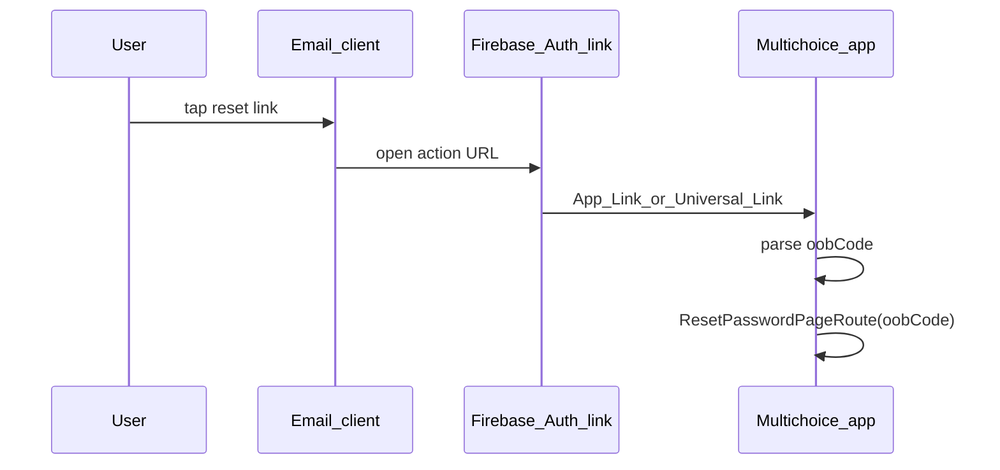

# Password reset email → Reset Password deep link

## What you have today

- `[RegistrationService.sendPasswordResetEmail](packages/core/lib/src/services/implementations/registration_service.dart)` calls `_auth.sendPasswordResetEmail(email: ...)` with **no** `ActionCodeSettings`, so the email uses Firebase’s default action link (browser / web handler), not your app.
- `[ResetPasswordPage](apps/multichoice/lib/presentation/registration/reset_password_page.dart)` already accepts `oobCode` and `[ResetPasswordBloc](packages/core/lib/src/application/reset_password/reset_password_bloc.dart)` calls `confirmPasswordReset` when `oobCode` is present—**the in-app reset path is ready**; what’s missing is **getting `oobCode` from the link into the route**.
- Native projects have **no** deep-link intent filters (`[AndroidManifest.xml](apps/multichoice/android/app/src/main/AndroidManifest.xml)`) or Universal Link domains (`[Info.plist](apps/multichoice/ios/Runner/Info.plist)`).

## How Firebase expects this to work

When you want the **mobile app to open first** on link tap, you pass an `[ActionCodeSettings](https://firebase.google.com/docs/auth/flutter/passing-state-in-email-actions)` to `sendPasswordResetEmail`:

- `**url`**: Your **continue URL** (HTTPS). Its **host** must appear under **Authentication → Sign-in method → Authorized domains** in Firebase Console.
- `**handleCodeInApp: true`**: Firebase generates a link meant to open via **Android App Links / iOS Universal Links** when the app is installed (otherwise falls back to the web action handler).
- `**androidPackageName`** / `**iOSBundleId`**: Must match `[co.za.zanderkotze.multichoice](apps/multichoice/android/app/build.gradle)` (and your iOS bundle ID from Xcode).
- `**linkDomain`** (preferred): A **custom domain connected to Firebase Hosting** in this project. Firebase docs state it **cannot** be a default `*.web.app` / `*.firebaseapp.com` domain—so you need a **custom Hosting domain** (or your own site that completes the Hosting-associated link setup per Firebase’s current Auth + Hosting link flow). `dynamicLinkDomain` is deprecated in favor of this.

The email link ultimately carries (or redirects into) parameters your app must read—typically `**oobCode`** and `**mode=resetPassword`**—which map directly to your existing reset flow.

## Firebase Console / infrastructure

1. **Authorized domains**
  Add the host you use in `ActionCodeSettings.url` (e.g. `https://yourdomain.com/reset` or your Hosting site path).
2. **Mobile app registration**
  In Project settings, ensure **Android** has the correct package name and **SHA-1/SHA-256** (required for App Links verification). Ensure **iOS** has bundle ID (and other Apple fields Firebase prompts for).
3. **Link domain for `handleCodeInApp`**
  Connect a **custom domain** to Firebase Hosting (or follow Firebase’s current doc for `linkDomain`) and pass that domain in `ActionCodeSettings`. This replaces reliance on deprecated Dynamic Links for new work.
4. **Hosting well-known files**
  For verified App Links / Universal Links, you must serve `assetlinks.json` (Android) and `apple-app-site-association` (iOS) from that domain—Firebase Hosting can host these; exact paths follow Android/iOS specs (often `/.well-known/`).

No change is strictly required to the **password reset email template** for the minimal path if `ActionCodeSettings` is supplied from the app; template customization is optional (see [custom email handlers](https://firebase.google.com/docs/auth/custom-email-handler) if you need branded domains in the visible link).

## App-side implementation (conceptual)

| Area        | Action                                                                                                                                                                                                                                                                                                                                                    |
| ----------- | --------------------------------------------------------------------------------------------------------------------------------------------------------------------------------------------------------------------------------------------------------------------------------------------------------------------------------------------------------- |
| **Core**    | Thread `ActionCodeSettings` into `sendPasswordResetEmail` (repository + service). Build settings from env/config: continue `url`, `handleCodeInApp: true`, `androidPackageName`, `iOSBundleId`, `linkDomain`, optional `androidInstallApp` / `androidMinimumVersion`.                                                                                     |
| **App**     | Add a link listener (`[app_links](https://pub.dev/packages/app_links)` is the common choice): `getInitialLink()` + `uriLinkStream`. On URI, extract `oobCode` (and confirm `mode` is reset if present), then `context.router.root.push(ResetPasswordPageRoute(oobCode: code))` or equivalent root navigation so it works when cold-started from the link. |
| **Android** | Add an `intent-filter` with `android:autoVerify="true"` for your HTTPS host + path prefix; ensure `launchMode` (you already use `singleTop`) works with incoming intents.                                                                                                                                                                                 |
| **iOS**     | Add **Associated Domains** entitlement for `applinks:your.host` and ensure Team/capabilities in Xcode match.                                                                                                                                                                                                                                              |

**Parsing note:** Depending on Firebase’s emitted URL shape (single hop vs wrapped), you may need to parse `oobCode` from the top-level query parameters or from a nested `link`/`continueUrl` query—**verify once with a real test email** and adjust parsing accordingly (keep it in one small helper).

**Tests:** Extend `[registration_service_test.dart](packages/core/test/src/services/registration_service_test.dart)` to assert `sendPasswordResetEmail` forwards the expected `ActionCodeSettings` to the mock.

## Risk / scope caveat

The exact Firebase product surface for `**linkDomain` + Hosting** vs legacy Dynamic Links is evolving; follow the official [Passing state in email actions (Flutter)](https://firebase.google.com/docs/auth/flutter/passing-state-in-email-actions) and your Firebase Console when creating the Hosting domain, and validate end-to-end on a physical device (email clients differ).