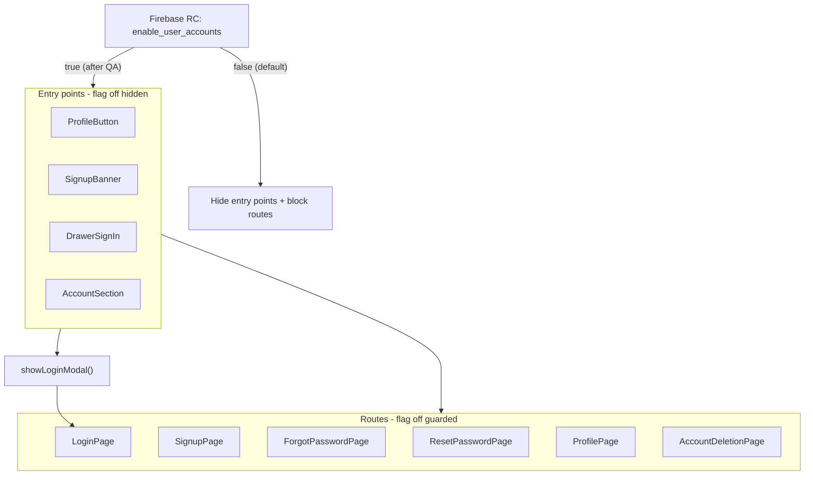

# User accounts feature-flagged release plan

## Current state

Uncommitted work on `develop` includes:

- New [`ProfileBloc`](packages/core/lib/src/application/profile/profile_bloc.dart) (load profile + logout)
- [`profile_page.dart`](apps/multichoice/lib/presentation/profile/profile_page.dart) refactored from `setState` to BLoC
- Shared [`ShineCard`](apps/multichoice/lib/presentation/shared/widgets/shine_card.dart) extracted (used by profile + signup)
- Missing codegen: `profile_bloc.g.dart` and injectable registration for `ProfileBloc`

**Auth and profile are currently always on** with no feature flag. Entry points include:

| Surface | File | What it does |
|---------|------|--------------|
| Home app bar | [`profile_button.dart`](apps/multichoice/lib/presentation/home/widgets/profile_button.dart) | Profile icon (logged in) or Sign in button (logged out) |
| Home banner | [`home_promotional_banners.dart`](apps/multichoice/lib/presentation/home/widgets/home_promotional_banners.dart) | Sign-up CTA carousel for guests |
| Drawer | [`home_drawer.dart`](apps/multichoice/lib/presentation/drawer/home_drawer.dart) | Account section (logged in), Sign in tile (logged out), logout |
| Login modal | [`login_modal.dart`](apps/multichoice/lib/presentation/registration/login_modal.dart) | Central `showLoginModal()` used by profile button, drawer, logout tile |
| Routes | [`app_router.dart`](apps/multichoice/lib/app/engine/app_router.dart) | `LoginPage`, `SignupPage`, `ForgotPasswordPage`, `ResetPasswordPage`, `ProfilePage`, `AccountDeletionPage` |

Existing flag pattern: [`FirebaseConfigKeys`](packages/models/lib/src/enums/firebase/firebase_config_keys.dart) + `coreSl<IFirebaseService>().isEnabled(...)`.



## Rollout decisions (confirmed)

- **Flag name:** `enable_user_accounts` (covers sign-in, sign-up, password flows, and profile)
- **Default:** `false` — ships disabled; enable in Firebase console after QA
- **Guard depth:** hide all entry points **and** block direct navigation to guarded routes
- **Profile requires registration:** profile is only reachable when the flag is on and the user is signed in (existing auth check unchanged)

### Flag-off behavior for existing sessions

Users who were already logged in before the flag ships stay logged in, but:

- No profile icon or account section
- No sign-in / sign-up prompts (banner, buttons, modals)
- Drawer logout still works ([`home_drawer.dart`](apps/multichoice/lib/presentation/drawer/home_drawer.dart), [`logout_tile.dart`](apps/multichoice/lib/presentation/drawer/widgets/logout_tile.dart))
- After logout, **do not** auto-open the login modal when flag is off

---

## 1. Branch and finish WIP

- Create a ticket branch from `develop` (e.g. `feature/<ticket>-user-accounts`) — **need a GitHub issue number** for changelog/PR
- Run Melos codegen (`make db`) for `profile_bloc.g.dart` and injectable `ProfileBloc` registration
- Commit refactor in logical chunks:
  1. `ProfileBloc` + export in [`export.dart`](packages/core/lib/src/application/export.dart)
  2. `ShineCard` extraction + signup usage
  3. `profile_page.dart` BLoC wiring

---

## 2. Add feature flag

### Model key

Add to [`firebase_config_keys.dart`](packages/models/lib/src/enums/firebase/firebase_config_keys.dart):

```dart
enableUserAccounts('enable_user_accounts'),
```

### Shared helper (app layer)

Add a small helper in the app (e.g. `apps/multichoice/lib/utils/user_accounts_feature.dart` or alongside existing utils):

```dart
bool isUserAccountsEnabled() =>
    coreSl<IFirebaseService>().isEnabled(FirebaseConfigKeys.enableUserAccounts);
```

Use this everywhere instead of inlining the check — keeps gating consistent and testable.

### Explicit local default

In [`firebase_service.dart`](packages/core/lib/src/services/implementations/firebase_service.dart):

```dart
FirebaseConfigKeys.enableUserAccounts.key: false,
```

### Gate entry points

| Location | Flag off behavior |
|----------|-------------------|
| [`profile_button.dart`](apps/multichoice/lib/presentation/home/widgets/profile_button.dart) | Render `SizedBox.shrink()` — hide both profile icon **and** Sign in button |
| [`home_promotional_banners.dart`](apps/multichoice/lib/presentation/home/widgets/home_promotional_banners.dart) | Do not show signup banner page (treat as dismissed / skip in carousel) |
| [`home_drawer.dart`](apps/multichoice/lib/presentation/drawer/home_drawer.dart) | Hide `AccountSection` and Sign in tile; keep logout tile when logged in |
| [`login_modal.dart`](apps/multichoice/lib/presentation/registration/login_modal.dart) | `showLoginModal()` returns immediately if flag off (central choke point) |
| [`home_drawer.dart`](apps/multichoice/lib/presentation/drawer/home_drawer.dart) `_onLogout` | Do not call `showLoginModal` after logout when flag off |
| [`logout_tile.dart`](apps/multichoice/lib/presentation/drawer/widgets/logout_tile.dart) | Same — no post-logout login modal when flag off |

### Guard routes

Add the same post-frame pop guard pattern to each page's `initState` (or a shared mixin/widget if repetition is high):

| Route / page | Guard |
|--------------|-------|
| [`login_page.dart`](apps/multichoice/lib/presentation/registration/login_page.dart) | Pop if flag off |
| [`signup_page.dart`](apps/multichoice/lib/presentation/registration/signup_page.dart) | Pop if flag off |
| [`forgot_password_page.dart`](apps/multichoice/lib/presentation/registration/forgot_password_page.dart) | Pop if flag off |
| [`reset_password_page.dart`](apps/multichoice/lib/presentation/registration/reset_password_page.dart) | Pop if flag off |
| [`profile_page.dart`](apps/multichoice/lib/presentation/profile/profile_page.dart) | Pop if flag off; skip bloc init |
| [`account_deletion_page.dart`](apps/multichoice/lib/presentation/profile/account_deletion_page.dart) | Pop if flag off |

**Debug tools:** [`debug_tools_content.dart`](apps/multichoice/lib/presentation/debug/widgets/debug_tools_content.dart) has a Reset Password shortcut — gate behind the same flag (or hide the tile when off).

### Firebase console (manual, pre-release)

Add boolean `enable_user_accounts` in Remote Config for dev/staging and prod:

- Default: `false` everywhere at ship time
- Enable `true` in dev/staging first for QA
- Enable `true` in prod only after sign-off

Debug Remote Config refetch ([`debug_tools_content.dart`](apps/multichoice/lib/presentation/debug/widgets/debug_tools_content.dart)) supports verifying toggles without reinstall.

---

## 3. Automated testing

### Core: `ProfileBloc` unit tests

New: `packages/core/test/src/application/profile/profile_bloc_test.dart`

Follow [`reset_password_bloc_test.dart`](packages/core/test/src/application/reset_password/reset_password_bloc_test.dart); use `MockLoginService`, `MockAppStorageService` from [`mocks.dart`](packages/core/test/mocks.dart).

| Test | Assert |
|------|--------|
| Initial state | `ProfileState.initial()` |
| `ProfileLoadStarted` | Loading transitions; email/username loaded |
| Email fallback | Uses `lastUsedEmail` when profile email empty |
| `ProfileLogoutRequested` | `deleteLoginInfo()`, `isLoggedOut: true` |

### App: feature-flag tests

Register `MockFirebaseService` (+ `MockLoginService` where needed) on `coreSl` in setUp/tearDown.

| Test file | Cases |
|-----------|-------|
| `profile_button_test.dart` | Flag off → nothing shown (logged in or out); flag on + logged out → Sign in; flag on + logged in → profile icon |
| `home_drawer_test.dart` | Flag off → no Sign in tile, no Account section; flag on → tiles appear when auth state matches |
| `login_modal_test.dart` | Flag off → `showLoginModal` does not open dialog; flag on → dialog opens |
| `home_promotional_banners_test.dart` | Flag off → no signup banner in carousel |
| `profile_page_test.dart` / auth page tests | Flag off → route pops immediately |

Run:

- `melos test:core`
- `melos exec --scope=multichoice -- flutter test test/presentation/`

### Analyzer

- `melos exec --scope=core -- flutter analyze`
- `melos exec --scope=multichoice -- flutter analyze`
- `melos exec --scope=models -- flutter analyze`

---

## 4. Manual QA checklist

Test on dev/staging with `enable_user_accounts = true`, then repeat key cases with flag `false`.

**Flag off (default)**

- [ ] Home app bar: no profile icon, no Sign in button
- [ ] Home screen: no sign-up promotional banner
- [ ] Drawer (logged out): no Sign in tile
- [ ] Drawer (logged in): no Account section; logout still works
- [ ] After logout: login modal does **not** auto-open
- [ ] Direct navigation to login, signup, forgot password, reset password, profile, account deletion → immediately returns
- [ ] Core app (tabs, entries, import banner, feedback, etc.) works unchanged

**Flag on**

- [ ] Sign-up banner appears for guests; navigates to signup
- [ ] Sign in button opens login modal; email + Google sign-in work
- [ ] Sign up page works (including shared `ShineCard`)
- [ ] Forgot password → reset password flow works
- [ ] After sign-in: profile icon + drawer Account section appear
- [ ] Profile page loads email/username
- [ ] Change password, delete account, logout from profile all work
- [ ] Toggle flag via debug Remote Config refetch → UI updates on revisit

**Edge cases**

- [ ] User logged in before flag enabled → profile hidden when flag off, accessible when flag on
- [ ] User logged in before flag enabled → can still logout when flag off

---

## 5. Release packaging

1. Update [`CHANGELOG.md`](CHANGELOG.md) with ticket number + bullets covering profile bloc, ShineCard, and `enable_user_accounts` gating
2. Logical commits:
   - `feat(core): add ProfileBloc for profile load and logout`
   - `refactor(multichoice): extract ShineCard and wire profile page to ProfileBloc`
   - `feat: gate user accounts behind enable_user_accounts remote config flag`
   - `test: add ProfileBloc and user accounts feature-flag coverage`
3. Open **draft PR** to `develop` with automated results, manual QA checklist, and note that Firebase RC key `enable_user_accounts` must be created before QA

---

## Risks and notes

- **No GitHub issue referenced yet** — provide ticket number before branch/changelog/PR naming
- **Existing logged-in users** may retain sessions when flag is off; they lose profile/auth UI but can still use the app and logout
- **Flag evaluated at build/navigation time** — RC toggle requires refetch + screen revisit; document in PR
- **Single flag** keeps rollout simple; sign-in and profile ship and enable together
