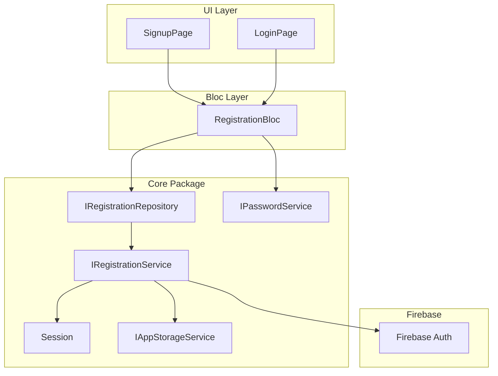

# Registration Backend Implementation

## Where Auth Data Is Stored

**Split storage by sensitivity:**

| Data            | Storage                    | Reason                                                                |
| --------------- | -------------------------- | --------------------------------------------------------------------- |
| Auth token      | **Flutter Secure Storage** | Encrypted; uses Keychain (iOS) / EncryptedSharedPreferences (Android) |
| Last-used email | **SharedPreferences**      | Non-sensitive; convenience for pre-filling forms                      |

**Session implementation changes:**

- **Current**: [login_service.dart](packages/core/lib/src/services/implementations/login_service.dart) (`SessionImpl`) uses SharedPreferences for `access_token` and `login_status`.
- **New**: Refactor `SessionImpl` to use `flutter_secure_storage` for the auth token. Store `access_token` in secure storage; derive `isUserLoggedIn()` from presence of token (or keep `login_status` in secure storage for consistency).
- Add `flutter_secure_storage` to [packages/core/pubspec.yaml](packages/core/pubspec.yaml).
- Register `SessionImpl` in DI (currently not registered). Have Registration Service call `storeLoginInfo(idToken)` after successful Firebase Auth signup/signin.

---

## Architecture Overview

---

## 1. New Data Classes (models package)

Add DTOs for registration and auth:

- **SignupRequestDTO**: `email`, `username`, `password` - input for signup.
- **AuthResultDTO** (or reuse existing pattern): `accessToken`, `userId` - result from successful auth.

Location: `packages/models/lib/src/dto/auth/` (new folder). Follow pattern from [feedback_dto.dart](packages/models/lib/src/dto/feedback/feedback_dto.dart) (CopyWith, Equatable, JSON if needed).

---

## 2. Password Service (core package)

Create injectable `IPasswordService` that wraps the existing `PasswordValidator` logic:

- **Interface**: `packages/core/lib/src/services/interfaces/i_password_service.dart`  
  - `bool isValid(String password)`  
  - `List<String> getUnmetRequirements(String password)`  
  - `String? validate(String? value)` (for FormFieldValidator)
- **Implementation**: `packages/core/lib/src/services/implementations/password_service.dart`  
  - Move/adapt logic from [password_validator.dart](apps/multichoice/lib/presentation/registration/utils/password_validator.dart) into the service.
- **App layer**: Update `PasswordField` to optionally accept injected validator or delegate to the service (or keep using static helper that mirrors the service for simple cases).

---

## 3. Registration Service (core package)

- **Interface**: `IRegistrationService`  
  - `Future<Either<AuthException, AuthResultDTO>> signUp(RegistrationDTO dto)`  
  - `Future<Either<AuthException, AuthResultDTO>> signIn(String email, String password)` (if login is also backed by this service)
- **Implementation**: Uses `firebase_auth`, `Session`, and `IAppStorageService`:
  1. Call `FirebaseAuth.instance.createUserWithEmailAndPassword(email, password)`.
  2. Set `displayName` from username via `user.updateDisplayName(username)`.
  3. Get ID token via `user.getIdToken()`.
  4. Call `Session.storeLoginInfo(idToken)`.
  5. Call `IAppStorageService.setLastUsedEmail(email)` (new method).
  6. Return `AuthResultDTO(accessToken: idToken, userId: user.uid)`.

Add `firebase_auth` to [packages/core/pubspec.yaml](packages/core/pubspec.yaml).

---

## 4. Registration Repository (core package)

- **Interface**: `IRegistrationRepository`  
  - `Future<Either<AuthException, AuthResultDTO>> signUp(RegistrationDTO dto)`  
  - (Optionally) `Future<Either<AuthException, AuthResultDTO>> signIn(String email, String password)`
- **Implementation**: Thin wrapper around `IRegistrationService` (or service can be used directly from Bloc if you prefer a flatter architecture; repository is useful if you expect to add caching or multiple auth sources later).

---

## 5. Registration Bloc (core package)

Events (sealed class):

- `RegistrationFieldsChanged` – `email`, `username`, `password` (or a field enum + value).
- `RegistrationSignupClicked` – submit signup.
- `RegistrationCancelClicked` – cancel/navigate back.

State:

- `email`, `username`, `password`, `isLoading`, `isSuccess`, `isError`, `errorMessage`.

Flow:

1. **Fields changed**: Update state with new field values.
2. **Signup clicked**:
  - Validate via `IPasswordService`.  
  - Call `IRegistrationRepository.signUp(RegistrationDTO(...))`.  
  - On success: emit `isSuccess`, optionally navigate (handled by UI).  
  - On failure: emit `isError`, `errorMessage`.
3. **Cancel clicked**: Reset state and pop route (or emit a navigatable state; UI handles pop).

Pattern reference: [FeedbackBloc](packages/core/lib/src/application/feedback/feedback_bloc.dart) (`FeedbackFieldChanged`, `SubmitFeedback`, `ResetFeedback`).

---

## 6. Local Email Persistence

- Add `lastUsedEmail` to [StorageKeys](packages/models/lib/src/enums/storage/storage_keys.dart).
- Add `Future<String?> get lastUsedEmail` and `Future<void> setLastUsedEmail(String email)` to [IAppStorageService](packages/core/lib/src/services/interfaces/i_app_storage_service.dart) and [AppStorageService](packages/core/lib/src/services/implementations/app_storage_service.dart).

Use `setLastUsedEmail` after successful signup/signin; pre-fill email on signup/login screens from `get lastUsedEmail`.

---

## 7. Session: Secure Storage + DI Registration

- **Refactor `SessionImpl`** to use `FlutterSecureStorage` instead of `SharedPreferences` for the auth token:
  - `storeLoginInfo(idToken)`: write `access_token` and `login_status` to secure storage.
  - `getAccessToken()`, `isUserLoggedIn()`, `deleteLoginInfo()`: read/delete from secure storage.
- Add `flutter_secure_storage` to core `pubspec.yaml`.
- Provide `FlutterSecureStorage` in InjectableModule (or use default instance).
- Register `SessionImpl` as `Session` in the injectable graph (inject `FlutterSecureStorage`).

Ensure `Session` is registered before any auth flow runs so `home_drawer` logout works.

---

## 8. Wire Up UI

- Replace mock logic in [SignupPage](apps/multichoice/lib/presentation/registration/signup_page.dart) and [LoginPage](apps/multichoice/lib/presentation/registration/login_page.dart) with `RegistrationBloc`.
- Pre-fill email from `IAppStorageService.lastUsedEmail` when the page loads.
- On signup success: navigate to home (or pop to root) and show success feedback.

---

## 9. Login Flow Integration

Your requirements focus on signup; the same `Session` and token storage apply to login. Options:

- Extend `IRegistrationService` with `signIn` and have `RegistrationBloc` (or a shared `AuthBloc`) handle both signup and signin.
- Or keep a separate `LoginBloc` that uses `IRegistrationService.signIn` and `Session.storeLoginInfo`.

---

## File Summary

| Layer  | New/Modified Files                                                                                                                             |
| ------ | ---------------------------------------------------------------------------------------------------------------------------------------------- |
| models | `dto/auth/registration_dto.dart`, `dto/auth/auth_result_dto.dart`                                                                              |
| core   | `services/interfaces/i_password_service.dart`, `services/implementations/password_service.dart`                                                |
| core   | `services/interfaces/i_registration_service.dart`, `services/implementations/registration_service.dart`                                        |
| core   | `repositories/interfaces/registration/i_registration_repository.dart`, `repositories/implementation/registration/registration_repository.dart` |
| core   | `application/registration/registration_bloc.dart`, `_event.dart`, `_state.dart`                                                                |
| core   | `login_service.dart` – ensure `@injectable` + DI registration                                                                                  |
| models | `storage_keys.dart` – add `lastUsedEmail`                                                                                                      |
| core   | `i_app_storage_service.dart`, `app_storage_service.dart` – add email get/set                                                                   |
| app    | `signup_page.dart`, `login_page.dart` – integrate RegistrationBloc, pre-fill email                                                             |

---

## Build and Test

- Run `melos run build_runner` (or `make db`) for generated code (bloc, freezed, injectable).
- Add unit tests for `RegistrationBloc`, `PasswordService`, and `RegistrationService` (with mocked Firebase Auth and Session).

