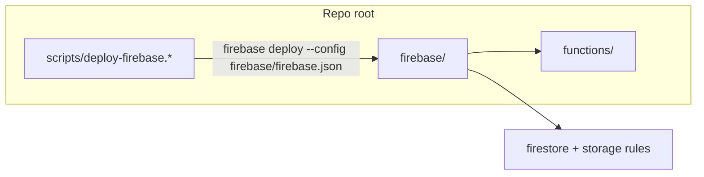

# Root config cleanup

## Target layout

```text
firebase/
  .firebaserc
  firebase.json
  firestore.rules
  firestore.indexes.json
  storage.rules

config/
  sonar-project.properties

.github/
  config.yml              # moved from root
  agents/
    code-reviewer.agent.md  # already correct; delete root duplicate
```

`functions/` stays at repo root (only referenced from [`firebase/firebase.json`](firebase/firebase.json)).

## Why this works

Firebase CLI resolves paths **relative to the directory containing `firebase.json`**, not the repo root. Deploy commands must pass `--config firebase/firebase.json` (or `-c`). With that flag, `.firebaserc` in the same `firebase/` folder is picked up automatically.



## File moves and content updates

### 1. Create `firebase/` and move Firebase artifacts

Move from root into [`firebase/`](firebase/):
- [`.firebaserc`](.firebaserc)
- [`firebase.json`](firebase.json)
- [`firestore.rules`](firestore.rules)
- [`firestore.indexes.json`](firestore.indexes.json)
- [`storage.rules`](storage.rules)

Update [`firebase/firebase.json`](firebase/firebase.json) paths:

| Key | Current | New |
|-----|---------|-----|
| `functions[].source` | `functions` | `../functions` |
| `flutter.platforms.dart` key | `lib/firebase_options.dart` | `../apps/multichoice/lib/firebase_options.dart` |

Rules/index paths (`firestore.rules`, etc.) stay as-is because they will live beside `firebase.json`.

### 2. Update deploy scripts

Both scripts `cd` to repo root today; add `--config firebase/firebase.json` to every `firebase deploy` call:

- [`scripts/deploy-firebase.sh`](scripts/deploy-firebase.sh) — `firebase deploy --config firebase/firebase.json ...`
- [`scripts/deploy-firebase.ps1`](scripts/deploy-firebase.ps1) — same

Also update help text/comments to reference `firebase/firebase.json`.

[`Makefile`](Makefile) targets (`firebase_deploy_dev`, etc.) need no change — they delegate to the scripts.

### 3. Move Sonar config

- Move [`sonar-project.properties`](sonar-project.properties) → [`config/sonar-project.properties`](config/sonar-project.properties)
- Update [`.github/workflows/sonarcloud.yml`](.github/workflows/sonarcloud.yml):

```yaml
- uses: SonarSource/sonarqube-scan-action@v8.1.0
  with:
    args: -Dproject.settings=config/sonar-project.properties
```

Keep existing `sonar.sources` / `sonar.tests` paths unchanged (they are already repo-root-relative and the scanner still runs from root).

### 4. Move workflow config

- Move [`config.yml`](config.yml) → [`.github/config.yml`](.github/config.yml)

**Note:** This file is documented but **not currently read by any workflow** (no references in [`.github/workflows/`](.github/workflows/) or actions). Moving it is safe; optionally add a one-line comment at the top of the file explaining it is reserved for future workflow wiring.

### 5. Remove duplicate agent file

[`code-reviewer.agent.md`](code-reviewer.agent.md) at root is **byte-identical** to [`.github/agents/code-reviewer.agent.md`](.github/agents/code-reviewer.agent.md). Delete the root copy only.

### 6. Documentation updates

Update path references in:
- [`docs/firebase-functions-environments.md`](docs/firebase-functions-environments.md) — `firebase/firebase.json`, `firebase/.firebaserc`, rules paths; example commands use `--config firebase/firebase.json` and `firebase use dev --config firebase/firebase.json`
- [`README.md`](README.md) — `config.yml` location under `.github/`
- [`docs/27-setup-workflows.md`](docs/27-setup-workflows.md) — `config.yml` location

## FlutterFire caveat (low risk for this repo)

`flutterfire configure` / `reconfigure` looks for `firebase.json` by walking up from the Flutter app dir — it will **not** auto-discover `firebase/firebase.json`. This project already manages Firebase options via flavor entry points and [`apps/multichoice/lib/firebase_options.dart`](apps/multichoice/lib/firebase_options.dart) + `AppConfig`, so day-to-day deploys are unaffected.

If you re-run FlutterFire later, either:
- run from repo root and manually maintain the `flutter` block in `firebase/firebase.json`, or
- pass explicit `--project` / `--out` flags from `apps/multichoice` (no dependency on root `firebase.json` discovery).

Document this briefly in [`docs/firebase-functions-environments.md`](docs/firebase-functions-environments.md).

## Validation

After changes:
1. `npm run build && npm run lint` in `functions/`
2. Dry-run deploy syntax: `firebase deploy --config firebase/firebase.json --only firestore:rules --project multichoice-app-develop --dry-run` (if supported) or a rules-only deploy to dev
3. Confirm Sonar workflow still finds properties via `project.settings`
4. Grep repo for stale root paths (`^firebase.json`, root `firestore.rules`, root `config.yml`, root `sonar-project.properties`)

## Out of scope (optional follow-up)

Root still has other clutter not in your list (e.g. `*.iml`, gitignored `multichoice-*.json` service accounts). Those can be tackled separately if you want a second cleanup pass.
