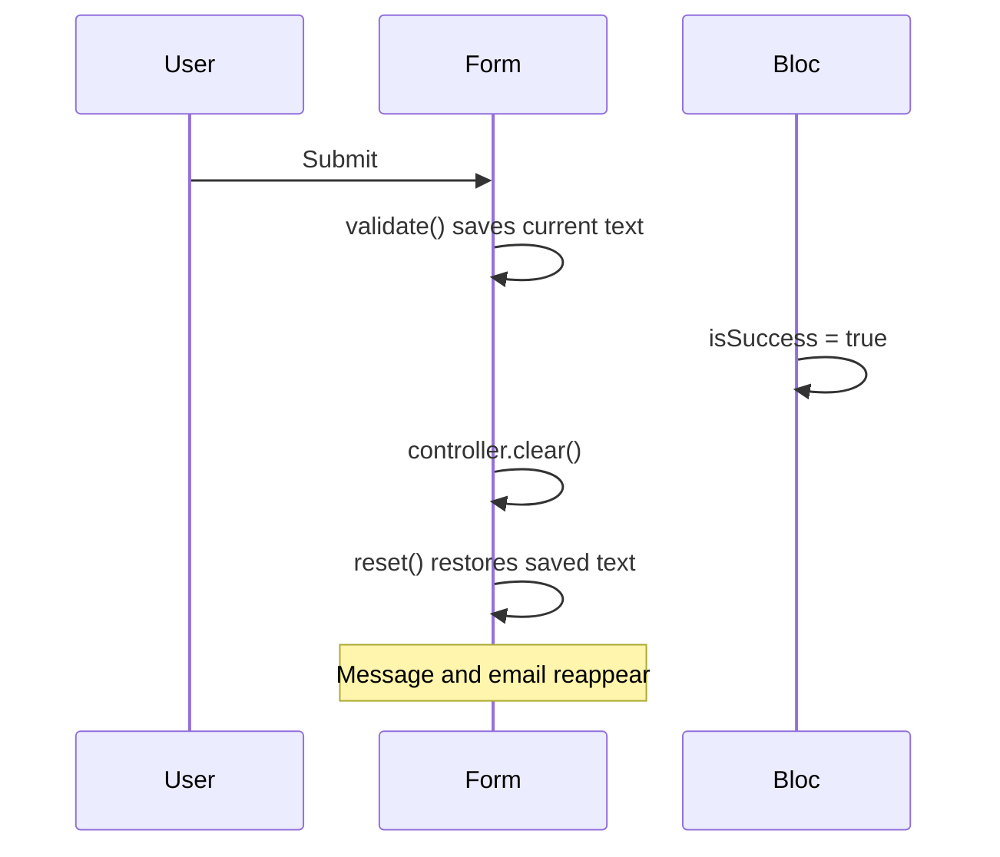
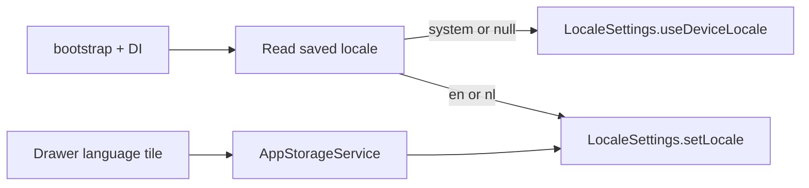

# Settings, feedback, and feature-flag plan

## 1. Fix feedback form clear (message + email)

**Root cause:** After submit, `[_resetFormFields()](apps/multichoice/lib/presentation/feedback/widgets/feedback_form.dart)` calls `_formKey.currentState?.reset()` *after* `validate()` ran on submit. `FormState.reset()` restores each field to the value saved during `validate()` — so message and email reappear even though controllers were cleared. Category and stars reset correctly because they live in `FeedbackBloc`, not `FormState`.




**Fix in** `[feedback_form.dart](apps/multichoice/lib/presentation/feedback/widgets/feedback_form.dart)`:

- Remove `_formKey.currentState?.reset()` from `_resetFormFields()`.
- Force a clean form rebuild on reset: wrap the `Form` (or both `TextFormField`s) in `KeyedSubtree(key: ValueKey(_formVersion))` and increment `_formVersion` (already done).
- Change category dropdown from `initialValue` to `value: state.feedback.category` (more reliable on reset).
- Reset rating to **unselected**: change `[FeedbackDTO.empty()](packages/models/lib/src/dto/feedback/feedback_dto.dart)` default `rating` from `1` to `0`; star UI already treats `rating < 1` as empty borders; bloc submit already rejects `rating < 1`.

**Test:** Add a focused widget test under `apps/multichoice/test/presentation/feedback/` that fills message/email, simulates success via `FeedbackBloc`, and asserts controllers are empty.

---

## 2. Fix feedback image paste (Android)

**Confirmed:** `feedback_images_enabled` RC is **on** in your environment. Issue reproduced on **Android only**.

**Current implementation** (`[feedback_form.dart](apps/multichoice/lib/presentation/feedback/widgets/feedback_form.dart)`):

- Uses `super_clipboard` (`^0.9.1`) via `SystemClipboard.instance.read()`
- Only accepts clipboard items where `reader.canProvide(Formats.png)` or `Formats.jpeg`
- Reads bytes asynchronously via `reader.getFile(format, callback)`; if `progress == null` or callback errors, shows generic `noImageInClipboard` snackbar

**Likely Android causes (not RC):**

1. **Missing `DataProvider` in AndroidManifest** — `super_clipboard` docs require a content provider under `<application>`. `[AndroidManifest.xml](apps/multichoice/android/app/src/main/AndroidManifest.xml)` does **not** declare it today. Add:

```xml
<provider
    android:name="com.superlist.super_native_extensions.DataProvider"
    android:authorities="${applicationId}.SuperClipboardDataProvider"
    android:exported="true"
    android:grantUriPermissions="true" />
```

1. **Format mismatch** — Android screenshots / gallery copies often land on the clipboard as a **content URI** or non-PNG/JPEG mime type. `canProvide(Formats.png/jpeg)` may return false even when an image is present → user sees “No image found in clipboard”.
2. **Async read edge cases** — `getFile` callback may not complete on some Android clipboard states (known `super_native_extensions` issues); errors are swallowed into the same generic snackbar.

**Fix approach (Android-focused):**


| Step             | Action                                                                                                                                              |
| ---------------- | --------------------------------------------------------------------------------------------------------------------------------------------------- |
| Manifest         | Add `DataProvider` with `${applicationId}.SuperClipboardDataProvider` authority (works for dev/prod suffixes)                                       |
| Format detection | After PNG/JPEG, probe additional `Formats` supported by `super_clipboard` (e.g. WebP/GIF if available); log in debug which formats `reader` exposes |
| Fallback read    | If standard formats fail, iterate `ClipboardReader` items / try `readValue` for other image types before giving up                                  |
| Error UX         | Replace single `noImageInClipboard` with distinct i18n strings: unsupported format vs read failure vs max-count/size exceeded (see §2b)             |
| QA               | Manual test matrix on Android: screenshot → paste, gallery image → copy → paste, immediate vs delayed paste                                         |


**Out of scope for first pass:** iOS/desktop paste unless regressions appear; do not add a new clipboard dependency unless `super_clipboard` fixes are insufficient after manifest + format broadening.

---

## 2b. Feedback image validation (Add Images + paste)

**Answer: No — there are currently no file-size or count checks.**

Both paths dispatch `FeedbackEvent.imageAdded` with no guards:

- **Add Images** — `[_pickImage](apps/multichoice/lib/presentation/feedback/widgets/feedback_form.dart)` uses `FilePicker.pickFiles(type: FileType.image, allowMultiple: true)` and adds every file unconditionally
- **Paste** — builds a `PlatformFile` from clipboard bytes and dispatches the same event
- **Bloc** — `[FeedbackImageAdded](packages/core/lib/src/application/feedback/feedback_bloc.dart)` appends to `imageFiles` with no limits
- **Repository** — uploads all files to Firebase Storage with no size pre-check

**Add centralized validation in `FeedbackBloc`** (so both pick and paste share rules):


| Rule                      | Proposed default | Behavior when exceeded                                                           |
| ------------------------- | ---------------- | -------------------------------------------------------------------------------- |
| Max images per submission | **3**            | Reject add; emit error state or return validation result consumed by UI snackbar |
| Max size per image        | **5 MB**         | Reject oversized file; show localized message with limit                         |
| Min size                  | > 0 bytes        | Reject empty/corrupt reads                                                       |


**Implementation sketch:**

- Add constants in `packages/core` (e.g. `FeedbackImageLimits.maxCount`, `maxBytesPerImage`) — not RC-driven unless you want remote tuning later
- On `FeedbackImageAdded`, validate before emit; on failure set `errorMessage` (reuse existing error snackbar path in `[feedback_page.dart](apps/multichoice/lib/presentation/feedback/feedback_page.dart)`) or add a dedicated non-blocking snackbar from the form listener
- In `_pickImage`, optionally pre-filter `result.files` and show which files were skipped
- i18n: `feedback.imageTooLarge`, `feedback.maxImagesReached`, `feedback.unsupportedClipboardImage` (en + nl)
- Tests: `feedback_bloc_test.dart` cases for over-limit count, over-limit size, and successful add under limits

**Note:** Firebase Storage has its own upload limits; client-side validation improves UX by failing fast before submit.

---

## 3. Gate Update Prompt behind a feature flag

**Recommendation: Yes.** Version strings (`latest_app_version`, `google_play_store_url`) can exist in RC without exposing the prompt to users until you are ready — same pattern as changelog/tutorial.

**Changes:**


| Area                                                                                                       | Action                                                                |
| ---------------------------------------------------------------------------------------------------------- | --------------------------------------------------------------------- |
| `[firebase_config_keys.dart](packages/models/lib/src/enums/firebase/firebase_config_keys.dart)`            | Add `enableUpdatePrompt('enable_update_prompt')` to `featureFlags`    |
| `[firebase_service.dart](packages/core/lib/src/services/implementations/firebase_service.dart)`            | Default `enable_update_prompt: false`                                 |
| `[update_modal_handler.dart](apps/multichoice/lib/presentation/home/widgets/update_modal_handler.dart)`    | Early-return in `_checkAndShow()` if `!isEnabled(enableUpdatePrompt)` |
| `[feature_flags_content.dart](apps/multichoice/lib/presentation/debug/widgets/feature_flags_content.dart)` | Add debug toggle label                                                |
| `[feature-flags.md](.cursor/references/architecture/feature-flags.md)`                                     | Document new flag                                                     |
| i18n                                                                                                       | `debug.featureFlags.enableUpdatePrompt` in en/nl JSON                 |


Debug “Show Update Prompt” in `[debug_tools_content.dart](apps/multichoice/lib/presentation/debug/widgets/debug_tools_content.dart)` can remain ungated (intentional dev override).

---

## 4. Gate About page; fallback to old modal when OFF

**Your choice:** When `enable_about_page` is **false**, show the old `showAboutDialog` from drawer (no route push).

**Changes:**


| Area                                                                                            | Action                                                                                                                                                         |
| ----------------------------------------------------------------------------------------------- | -------------------------------------------------------------------------------------------------------------------------------------------------------------- |
| `[firebase_config_keys.dart](packages/models/lib/src/enums/firebase/firebase_config_keys.dart)` | Add `enableAboutPage('enable_about_page')` to `featureFlags`                                                                                                   |
| `[firebase_service.dart](packages/core/lib/src/services/implementations/firebase_service.dart)` | Default `enable_about_page: false`                                                                                                                             |
| New `[about_feature.dart](apps/multichoice/lib/utils/about_feature.dart)`                       | `isAboutPageEnabled()` + `guardAboutPageRoute(context)` (mirror `[tutorial_feature.dart](apps/multichoice/lib/utils/tutorial_feature.dart)`)                   |
| `[more_section.dart](apps/multichoice/lib/presentation/drawer/widgets/more_section.dart)`       | If flag on → `push(AboutPageRoute)`; if off → localized `showAboutDialog` with playstore icon, app version from `IAppInfoService`, short description from i18n |
| `[about_page.dart](apps/multichoice/lib/presentation/about/about_page.dart)`                    | Call `guardAboutPageRoute(context)` in `initState` / first frame                                                                                               |
| i18n                                                                                            | Add `about.dialogDescription` (en/nl) for modal body text; reuse existing `about.appName`, `about.title`                                                       |
| Debug + docs                                                                                    | Same pattern as other flags                                                                                                                                    |


**Old modal reference** (pre-#363, localized version):

```dart
showAboutDialog(
  context: context,
  applicationName: context.t.about.appName,
  applicationVersion: appVersion,
  applicationIcon: Image.asset(Assets.images.playstore.path, width: 64, height: 64),
  children: [Text(context.t.about.dialogDescription)],
);
```

When flag is **on** but RC URLs are still empty, current `[AboutPage](apps/multichoice/lib/presentation/about/about_page.dart)` behavior (icon + name, sections hidden) remains — no dummy links needed until you configure Firebase.

---

## 5. User-selectable language setting

**Current:** `[run_multichoice.dart](apps/multichoice/lib/app/run_multichoice.dart)` always calls `LocaleSettings.useDeviceLocale()` before `bootstrap()` — device locale only, no persistence.

**Target UX:** Drawer → Appearance → **Language** tile opening a simple picker: **System default** / **English** / **Nederlands**.




**Changes:**


| Layer                                                                                                                                                                                                        | Action                                                                                                                                                                                                                                         |
| ------------------------------------------------------------------------------------------------------------------------------------------------------------------------------------------------------------ | ---------------------------------------------------------------------------------------------------------------------------------------------------------------------------------------------------------------------------------------------- |
| `[storage_keys.dart](packages/models/lib/src/enums/storage/storage_keys.dart)`                                                                                                                               | Add `appLocale('_appLocale')` — values: `system`, `en`, `nl`                                                                                                                                                                                   |
| `[i_app_storage_service.dart](packages/core/lib/src/services/interfaces/i_app_storage_service.dart)` + `[app_storage_service.dart](packages/core/lib/src/services/implementations/app_storage_service.dart)` | `getAppLocale()` / `setAppLocale(String)`                                                                                                                                                                                                      |
| `[run_multichoice.dart](apps/multichoice/lib/app/run_multichoice.dart)`                                                                                                                                      | Move locale init **after** `await bootstrap()`; apply saved preference                                                                                                                                                                         |
| New `language_tile.dart` (part of drawer `export.dart`)                                                                                                                                                      | `ListTile` in `[appearance_section.dart](apps/multichoice/lib/presentation/drawer/widgets/appearance_section.dart)`; `showDialog` with `RadioListTile` options; on select: persist + `LocaleSettings.setLocale` / `useDeviceLocale` for system |
| i18n                                                                                                                                                                                                         | `drawer.language`, `drawer.languageSystem`, `drawer.languageEnglish`, `drawer.languageDutch`                                                                                                                                                   |
| Analytics                                                                                                                                                                                                    | Add `AnalyticsButton.language` in `[analytics_button.dart](packages/models/lib/src/enums/analytics/analytics_button.dart)`                                                                                                                     |
| Tests                                                                                                                                                                                                        | Unit test for storage; widget test that tile calls `setAppLocale`                                                                                                                                                                              |


`TranslationProvider` already rebuilds the tree on `LocaleSettings` changes — no `Multichoice` widget changes required beyond existing `locale: TranslationProvider.of(context).flutterLocale`.

---

## Validation

- `melos exec --scope=multichoice -- flutter analyze`
- `melos exec --scope=core -- flutter analyze` (storage interface change)
- `melos test:multichoice` for new feedback + language tests
- `melos exec --scope=core -- flutter test` for feedback bloc image-limit tests
- `make slang` after i18n edits
- `make db` if `AnalyticsButton` enum change needs codegen in models/core mocks

## Firebase console (manual, post-merge)

- Add `enable_update_prompt` (bool, default `false`)
- Add `enable_about_page` (bool, default `false`)
- Enable `enable_about_page` when About RC URLs are ready
- Enable `enable_update_prompt` when store listing + version policy are ready
- Configure About URL strings when enabling the new page

