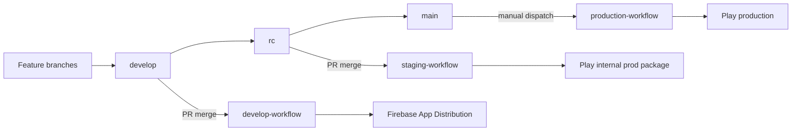
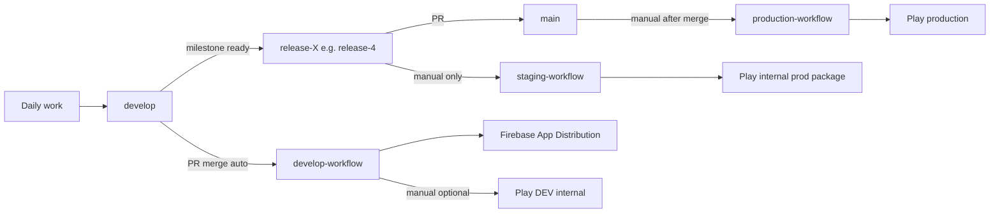

# Simplify Branching, Merging, and CI/CD

## Current state (to archive)

The legacy flow is a **4-branch GitFlow-style pipeline**:

Key legacy behaviors documented today in [`.github/README.md`](.github/README.md), [`docs/workflows/README.md`](docs/workflows/README.md), and [`CONTRIBUTING.md`](CONTRIBUTING.md):

| Branch | Workflow | Trigger | Deploy target | Version rules |
|--------|----------|---------|---------------|---------------|
| `develop` | [`develop_workflow.yml`](.github/workflows/develop_workflow.yml) | PR merge + manual | Firebase (+ AAB artifact) | `minor`/`patch` labels (docs stale; action now uses `feature`/`bug`) |
| `rc` | [`staging_workflow.yml`](.github/workflows/staging_workflow.yml) | PR merge + manual | Play internal (prod flavor) | `-RC` suffix; `major`/`minor`/`patch` labels |
| `main` | [`production_workflow.yml`](.github/workflows/production_workflow.yml) | Manual only | Play production | Strips `-RC` from pubspec, increments build |

Supporting automation: [`linting_workflow.yml`](.github/workflows/linting_workflow.yml) on all PRs, [`issue_automation.yml`](.github/workflows/issue_automation.yml) for label assignment, [`check-version-labels`](.github/actions/check-version-labels/action.yml) for bump resolution.

**Known drift to capture in the archive doc:** PR template still references `major`/`minor`/`patch` checkboxes; workflows still pass removed `allowed_labels` inputs; develop workflow mislabels an APK upload step as "Upload Android App Bundle"; [`docs/workflows/README.md`](docs/workflows/README.md) says production triggers on PR to `main` (incorrect — it is manual only).

---

## Target state (your TODO + choices)

**Branching**

1. All active development and fixes land in `develop` via PR (unchanged habit).
2. When a milestone/release is ready, create `release-X` from `develop` (e.g. `release-4` for Release 4).
3. Open PR `release-X` → `main`; merge when staging validation is done.
4. Retire the `rc` branch (delete on GitHub after cutover; no workflow references remain).

**Triggers (confirmed)**

- **Develop:** keep auto-deploy on merged PRs to `develop`; add manual `workflow_dispatch` option to also push to Play DEV internal track.
- **Staging:** **manual dispatch only** on a selected `release-X` branch (no PR-closed trigger).
- **Production:** manual dispatch on `main` after `release-X` merge, with a validated semver text input.

---

## 1. Create legacy archive doc

Add [`docs/archive/legacy-rc-branch-cicd.md`](docs/archive/legacy-rc-branch-cicd.md) (new folder + file):

- Purpose banner: **superseded as of [date]**; kept for historical reference.
- Branch diagram and step-by-step release walkthrough (develop → rc → main).
- Per-workflow summary with triggers, secrets/flavors, artifact outputs, version suffix rules.
- Label → version mapping as it existed pre-refactor.
- Known quirks/drift listed above.
- Migration note pointing to the new doc (to be updated in step 6).

No code changes in this step — documentation only.

---

## 2. Update version label semantics

Extend [`check-version-labels/action.yml`](.github/actions/check-version-labels/action.yml) to match your rules:

| Label(s) | Bump |
|----------|------|
| `feature`, `minor` | minor |
| `bug`, `patch` | patch |
| `documentation`, `dev-ops`, `maintenance` (optional) | build only (`none`) |
| `no-build` | skip workflow (existing) |
| default (no bump label) | build only |

Priority order: `no-build` → minor labels → patch labels → build-only labels → default build-only.

Update callers:

- [`develop_workflow.yml`](.github/workflows/develop_workflow.yml): remove stale `allowed_labels`; pass `feature_label`/`bug_label` if needed.
- [`staging_workflow.yml`](.github/workflows/staging_workflow.yml): same; keep `-RC` suffix on release branches during staging builds.
- [`issue_automation.yml`](.github/workflows/issue_automation.yml): map PR template checkboxes to `feature`/`bug`/`patch`/`minor`/`no-build` instead of legacy `major`/`minor`/`patch`.
- [`.github/pull_request_template.md`](.github/pull_request_template.md): replace version section with the new label rules (drop `major` checkbox from develop flow; major bumps handled at prod release input).

Add/adjust unit-style shell tests only if a test harness already exists for actions; otherwise validate via workflow dry-run inputs.

---

## 3. Refactor `develop-workflow`

File: [`develop_workflow.yml`](.github/workflows/develop_workflow.yml)

**Keep**

- PR-closed trigger on `develop` (merged, not `no-build`).
- Firebase APK distribution on successful PR merges.
- Compute → build → commit version pattern via [`version-management`](.github/actions/version-management/action.yml).

**Add (manual dispatch inputs)**

- `deploy_to_play_dev_internal` (boolean, default `false`): when true, build AAB and upload to Play internal track for `co.za.zanderkotze.multichoice.dev` using `r0adkll/upload-google-play@v1` (same pattern as staging prod upload).
- Keep existing `bump_type` + `dry_run` for manual testing.

**Speed improvements**

- Remove GitHub artifact upload steps unless needed for debugging (Firebase only needs the APK file on disk).
- Build AAB **only when** `deploy_to_play_dev_internal` is true (manual dispatch); skip AAB on routine PR merges.
- Remove duplicate/misnamed artifact step (APK currently uploaded under "Upload Android App Bundle" name).
- Consider dropping `melos coverage:core` from develop build job (linting workflow already runs coverage on PRs) — optional ~1–2 min savings; call out in PR if removed.

**Behavior on PR merge:** APK → Firebase only (fast path).

---

## 4. Refactor `staging-workflow` (release-X, manual only)

File: [`staging_workflow.yml`](.github/workflows/staging_workflow.yml) (rename workflow display name from `rc-workflow` → `staging-workflow` for clarity; filename can stay).

**Triggers**

- Remove `pull_request` trigger entirely.
- `workflow_dispatch` only with inputs:
  - `target_branch` (string, required): e.g. `release-4`; validate matches `^release-[0-9]+$`.
  - `dry_run` (boolean, existing).

**Branch references**

- Replace all `branch_name: rc` with `inputs.target_branch`.
- Checkout `ref: inputs.target_branch` in all jobs.
- Keep prod flavor build, `-RC` suffix, Play internal (prod package) upload.

**Speed improvements**

- Remove artifact upload step (Play upload uses local AAB; no GitHub artifact needed unless you want a retention copy — default: remove).

---

## 5. Refactor `production-workflow`

File: [`production_workflow.yml`](.github/workflows/production_workflow.yml)

**Replace RC-stripping logic** in `preBuild` with manual semver input:

- New input: `release_version` (string, required): e.g. `1.4.5`.
- Validation: `^[0-9]+\.[0-9]+\.[0-9]+$` (reject `-RC`, `,`, spaces, pre-release tags).
- Compute final version as `{release_version}+{build_number}` where `build_number = current_pubspec_build + 1` (preserve monotonic Play build codes).
- Remove deprecated `release_type` choice input.
- Default `target_branch` to `main`; keep `dry_run` and `skip_github_release`.

**Deploy**

- Keep Play production upload + GitHub Release (APK artifact still needed for release job — keep APK build + one artifact upload for `create-release` job only, or upload APK directly without storing as long-lived artifact if action supports file path).

**Notifications**

- Update branch references from `rc`/`main` hardcoding where environment-specific.

---

## 6. Update supporting docs and references

| File | Change |
|------|--------|
| [`.github/README.md`](.github/README.md) | New flow; link to archive doc |
| [`docs/workflows/README.md`](docs/workflows/README.md) | Rewrite for new flow or redirect to archive + new doc |
| [`CONTRIBUTING.md`](CONTRIBUTING.md) | CI/CD table: develop / release-X / main |
| [`docs/play-console-dev-internal-testing.md`](docs/play-console-dev-internal-testing.md) | Note Play DEV internal via manual develop dispatch (not artifact download) |
| [`.github/workflows/sonarcloud.yml`](.github/workflows/sonarcloud.yml) | Replace `rc` branch with `release-*` pattern or `main` only |
| [`TODO`](TODO) | Check off completed items after implementation |

Add a short **active** doc: [`docs/workflows/solo-developer-cicd.md`](docs/workflows/solo-developer-cicd.md) with the new runbook:

1. Merge PR to `develop` → Firebase build.
2. Optional: manual develop workflow → Play DEV internal.
3. Cut `release-X` from `develop`; manual staging on that branch → Play prod internal.
4. PR `release-X` → `main`; merge.
5. Manual prod workflow on `main` with `release_version`.

---

## 7. GitHub repo housekeeping (manual, post-merge)

These are outside workflow YAML but required for a clean cutover:

- Delete or archive the `rc` branch on GitHub.
- Update branch protection rules: remove `rc` requirements; optionally protect `release-*` and `main`.
- Confirm Play Console tracks: DEV internal (`co.za.zanderkotze.multichoice.dev`), prod internal, prod production — already documented in [`docs/play-console-dev-internal-testing.md`](docs/play-console-dev-internal-testing.md).

---

## Validation plan

1. **Dry-run** each workflow via `workflow_dispatch` with `dry_run: true` on `develop`, a test `release-X` branch, and `main`.
2. **Label matrix:** open test PRs (or use manual `bump_type`) verifying `feature`/`minor` → minor, `bug`/`patch` → patch, `documentation`/`dev-ops` → build-only.
3. **Prod input validation:** reject `1.4.5-RC`, `1,4,5`, `v1.4.5`; accept `1.4.5`.
4. Run `melos exec --scope=multichoice -- flutter analyze` only if Dart/Flutter code touched (workflow-only change → workflow YAML lint + dry runs sufficient).
5. First real release drill: cut `release-X`, manual staging, merge to `main`, manual prod with intended semver.

---

## Risk notes

- **Build number monotonicity:** prod manual semver must still increment `+build`; document that Play rejects reused version codes.
- **Release branch drift:** after prod release, merge `main` back into `develop` (document in runbook; not automated unless requested).
- **First release-X cut:** pubspec on `release-X` will not have `-RC` until first staging run — version-management handles suffix on staging branch commits.
- **SonarCloud / Dependabot:** update branch lists so quality gates still run on relevant branches.
