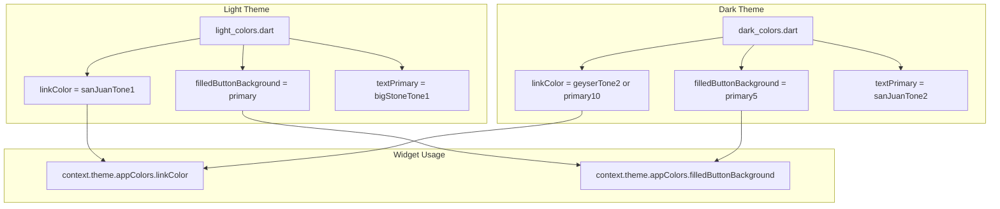

# Theme Structure and Semantic App Colors Improvements

## Current Problems Identified

### 1. Theme folder structure is confusing

- **Mixed concerns**: [app_theme.dart](apps/multichoice/lib/app/view/theme/app_theme.dart) mixes `ChangeNotifier` (theme mode persistence), static `ThemeData` getters, and `part` directives
- **Naming inconsistency**: `theme_extension/` folder contains `_light_app_colors.dart` and `_dark_app_colors.dart` (color *values*), while `theme_extension/app_theme_extension.dart` is the actual ThemeData extension - misleading naming
- **Scattered locations**: Palette in `app_palette.dart`, extension definition in `packages/theme`, color values in app - three different layers in different places

### 2. Primary color semantic mismatch (your main pain point)


| Context                     | Light mode `primary`               | Dark mode `primary`             |
| --------------------------- | ---------------------------------- | ------------------------------- |
| Value                       | geyserTone1 (#d7e0e5) - light gray | primary5 (#121625) - near black |
| Use in login "Sign Up" link | Readable (dark on light bg)        | **Invisible** (dark on dark bg) |
| Use for FilledButton bg     | Light gray bg - poor contrast      | Dark bg - OK                    |


The same `primary` name means opposite roles: in light mode it's effectively a foreground color; in dark mode it's a surface/background color. Using `context.theme.appColors.primary` for a button or link yields unpredictable results across themes.

### 3. Direct palette bypass

Theme components and widgets often use `AppPalette.geyserTone1`, `AppPalette.sanJuanTone2`, `AppPalette.white` directly (e.g., in [dark_app_theme.dart](apps/multichoice/lib/app/view/theme/dark_app_theme.dart) lines 20-21 for ElevatedButton), bypassing the theme system and breaking dark/light consistency.

---

## Proposed Solution

### Part A: Semantic color system in AppColorsExtension

Add **usage-based** color getters to [packages/theme/lib/src/colors/app_colors_extension.dart](packages/theme/lib/src/colors/app_colors_extension.dart):

```dart
// Semantic color groups (new fields)
// Buttons
Color? get filledButtonBackground => ...
Color? get filledButtonForeground => ...
Color? get outlinedButtonForeground => ...
Color? get outlinedButtonBorder => ...
Color? get textButtonForeground => ...
Color? get textButtonBackground => ...

// Surfaces
Color? get scaffoldBackground => background;  // alias initially
Color? get cardBackground => secondary;
Color? get modalBackground => secondary;
Color? get appBarBackground => foreground;

// Content / text
Color? get textPrimary => ...      // high-emphasis text
Color? get textSecondary => ...   // body text
Color? get textTertiary => ...    // muted/hint text
Color? get iconColor => ...
Color? get linkColor => ...       // for "Sign Up", "Forgot Password" etc.

// Brand (optional - keep primary for accent if desired)
Color? get accent => ...
```

Each semantic color will be assigned per theme in `_light_app_colors` and `_dark_app_colors`. For example:

- `linkColor` in light: dark blue (readable on light bg)
- `linkColor` in dark: light blue/white (readable on dark bg)

TailorMixin will require adding these as `@override` fields. We can either add them as stored fields or as computed getters that delegate to existing fields during migration.

**Recommended approach**: Add new fields to the extension (Tailor generates copyWith/lerp), populate them in light/dark definitions. Migrate usages gradually.

### Part B: Theme folder structure improvements

```text
apps/multichoice/lib/app/view/theme/
├── app_theme.dart           # ChangeNotifier + ThemeData.light/dark getters
├── app_palette.dart         # Keep - raw design tokens
├── app_typography.dart      # Keep
├── theme_data/
│   ├── light_theme_data.dart   # _light ThemeData (move from light_app_theme)
│   ├── dark_theme_data.dart   # _dark ThemeData (move from dark_app_theme)
│   ├── light_colors.dart      # _lightAppColors (from theme_extension/_light_app_colors)
│   └── dark_colors.dart       # _darkAppColors (from theme_extension/_dark_app_colors)
├── extensions/
│   └── app_theme_extension.dart   # ThemeData.appColors, appTextTheme
└── (remove theme_extension/ or repurpose)
```

- Rename `theme_extension` to `theme_data` + `extensions` for clearer separation
- `light_colors.dart` / `dark_colors.dart`: define `AppColorsExtension` instances with semantic colors
- `app_theme_extension.dart`: stays as the `ThemeData` extension; lives under `extensions/`

### Part C: Fix theme component definitions

Update [light_app_theme.dart](apps/multichoice/lib/app/view/theme/light_app_theme.dart) and [dark_app_theme.dart](apps/multichoice/lib/app/view/theme/dark_app_theme.dart) (or the new theme_data files) to use semantic colors:

- FilledButton: `backgroundColor: _lightAppColors.filledButtonBackground`
- ElevatedButton (dark): replace `AppPalette.primary0` / `AppPalette.white` with `filledButtonBackground` / `filledButtonForeground`
- Dialog: `backgroundColor: _lightAppColors.modalBackground`
- AppBar: `backgroundColor: _lightAppColors.appBarBackground`

### Part D: Migration of widget usages


| Current usage                                 | Migrate to                                             |
| --------------------------------------------- | ------------------------------------------------------ |
| `appColors.primary` for link text             | `appColors.linkColor`                                  |
| `appColors.primary` for icon color            | `appColors.iconColor`                                  |
| `appColors.primary` for button-style surfaces | `appColors.filledButtonBackground` or `cardBackground` |
| `appColors.secondary` for card background     | `appColors.cardBackground`                             |
| `appColors.ternary` for body text             | `appColors.textSecondary` or `textTertiary`            |
| `appColors.foreground` for app bar            | `appColors.appBarBackground`                           |


---

## Implementation order

1. **Extend AppColorsExtension** with semantic fields in `packages/theme`
2. **Populate semantic colors** in `_light_app_colors` and `_dark_app_colors` (map to existing palette values initially)
3. **Update theme component definitions** (FilledButtonTheme, DialogTheme, etc.) to use semantic colors
4. **Migrate widget usages** (link text, icons, cards) - highest impact files: login_page, signup_page, entry_card, details pages, menu_widget
5. **Restructure theme folder** (optional, can be done last for clarity)

---

## Migration strategy

- Keep existing `primary`, `secondary`, `ternary` etc. during migration
- Add semantic fields as new fields; widgets can migrate one-by-one
- Once migration is complete, consider deprecating non-semantic names or documenting them as "legacy"

---

## Diagram: Semantic color flow




---

## Files to modify


| File                                                      | Changes                                                       |
| --------------------------------------------------------- | ------------------------------------------------------------- |
| `packages/theme/lib/src/colors/app_colors_extension.dart` | Add semantic color fields (TailorMixin requires regeneration) |
| `apps/.../theme_extension/_light_app_colors.dart`         | Populate semantic colors                                      |
| `apps/.../theme_extension/_dark_app_colors.dart`          | Populate semantic colors                                      |
| `light_app_theme.dart` / `dark_app_theme.dart`            | Use semantic colors in ButtonTheme, DialogTheme, etc.         |
| ~25 widget files                                          | Replace `primary`/`secondary`/`ternary` with semantic names   |
| `app_colors_content.dart`                                 | Extend debug view with new semantic colors                    |


