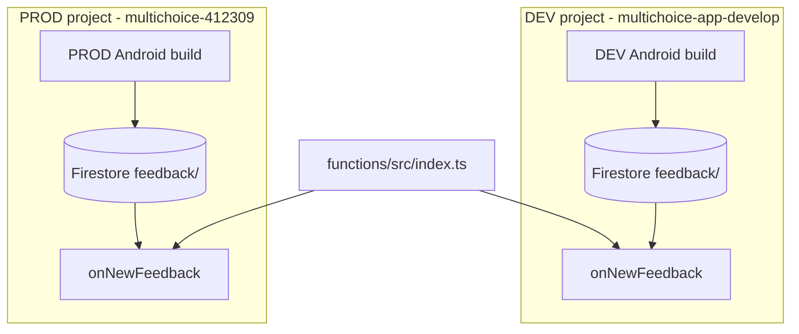

# Firebase Cloud Functions — DEV and PROD setup

This guide explains how to deploy the shared [`functions/`](../functions/) codebase to both Firebase projects used by the Multichoice Android app.

| Environment | Firebase project | Android app | App entry point |
|-------------|------------------|-------------|-----------------|
| **DEV** | `multichoice-app-develop` | `co.za.zanderkotze.multichoice.dev` | `main_develop.dart` |
| **PROD** | `multichoice-412309` | `co.za.zanderkotze.multichoice` | `main_production.dart` |

The Flutter app connects to whichever project its flavor config points at ([`docs/environment-config.md`](environment-config.md)). Cloud Functions must be deployed **into that same project** or triggers (e.g. feedback email) will never run.

For a walkthrough of the TypeScript code, see [`setting-up-firebase-functions.md`](setting-up-firebase-functions.md).

---

## What gets deployed

From the repo root, [`firebase.json`](../firebase.json) defines:

| Resource | File(s) | Notes |
|----------|---------|-------|
| Cloud Functions | `functions/src/index.ts` | Gen 2, region `europe-west1` |
| Firestore rules | `firestore.rules` | Allows anonymous `feedback/` creates |
| Firestore indexes | `firestore.indexes.json` | Deploy with rules when indexes change |
| Storage rules | `storage.rules` | Feedback image uploads under `feedback/` |

### Current function: `onNewFeedback`

- **Trigger:** Firestore document created at `feedback/{feedbackId}`
- **Region:** `europe-west1`
- **Behaviour:** Sends a notification email via Gmail (Nodemailer). Subject and body are prefixed with `[DEV]` or `[PROD]` based on the deployed Firebase project.
- **Params:** `EMAIL_USER`, `EMAIL_PASS` (via Firebase Functions params / `.env` files)

The same source code is deployed to DEV and PROD. Only the **target Firebase project** and **environment variables** differ.

---

## Architecture



---

## Prerequisites

### Tools

```bash
node --version    # functions/package.json requires Node 22
npm --version
firebase --version   # or: npx -y firebase-tools@latest --version
```

Install / update Firebase CLI:

```bash
npm install -g firebase-tools
firebase login
```

### Firebase project requirements (each project: DEV and PROD)

1. **Blaze (pay-as-you-go) plan** — required for Cloud Functions.
2. **Firestore** — `(default)` database. Prefer location **eur3** to match [`firebase.json`](../firebase.json).
3. **Cloud Storage** — default bucket (needed if feedback attachments use Storage).
4. **Cloud Functions API** — enabled automatically on first deploy (or enable in Google Cloud Console).

### Gmail (for feedback emails)

Both environments need valid email credentials:

1. Enable **2-factor authentication** on the Gmail account.
2. Create an **App Password** (Google Account → Security → App Passwords).
3. Use the app password as `EMAIL_PASS` (not your normal Gmail password).

You can use the same Gmail as prod for dev. Notification emails include `[DEV]` or `[PROD]` in the subject and an **Environment** line in the body so you can tell them apart in one inbox.

---

## Step 1: Configure Firebase project aliases

Update [`.firebaserc`](../.firebaserc) at the repo root:

```json
{
  "projects": {
    "default": "multichoice-412309",
    "prod": "multichoice-412309",
    "dev": "multichoice-app-develop"
  }
}
```

Switch active project:

```bash
firebase use dev    # multichoice-app-develop
firebase use prod   # multichoice-412309
firebase projects:list
```

---

## Step 2: Environment variables (per project)

The function uses Firebase Functions **params** ([`defineString`](https://firebase.google.com/docs/functions/config-env)):

```typescript
const emailUser = defineString("EMAIL_USER");
const emailPass = defineString("EMAIL_PASS");
```

### Recommended: project-specific `.env` files

Create **gitignored** files under `functions/`:

| File | Used when deploying to |
|------|------------------------|
| `functions/.env.multichoice-app-develop` | DEV |
| `functions/.env.multichoice-412309` | PROD |

Example `functions/.env.multichoice-app-develop`:

```env
EMAIL_USER=your-gmail@gmail.com
EMAIL_PASS=your-gmail-app-password
```

Example `functions/.env.multichoice-412309`:

```env
EMAIL_USER=your-gmail@gmail.com
EMAIL_PASS=your-gmail-app-password
```

Firebase CLI automatically loads `.env` and `.env.<projectId>` on deploy. Do **not** commit these files (root `.gitignore` already ignores `.env*`).

### Alternative: Firebase Console

After first deploy: Firebase Console → **Functions** → select `onNewFeedback` → **Environment variables** → add `EMAIL_USER` and `EMAIL_PASS`.

### Local emulator

For `firebase emulators:start`, you can use `functions/.env` or `functions/.env.local` with the same keys.

---

## Step 3: Install and build functions

From repo root:

```bash
cd functions
npm install
npm run build
npm run lint
cd ..
```

---

## Step 4: First-time DEV setup

Run these once when standing up the dev Firebase project.

### 4.1 Select dev project

```bash
firebase use dev
```

### 4.2 Deploy Firestore rules and indexes

Required before the app can write to `feedback/` in dev:

```bash
firebase deploy --only firestore:rules,firestore:indexes
```

### 4.3 Deploy Storage rules (if using feedback images)

```bash
firebase deploy --only storage
```

### 4.4 Deploy functions

Ensure `functions/.env.multichoice-app-develop` exists, then:

```bash
firebase deploy --only functions --project multichoice-app-develop
```

Or, with alias:

```bash
firebase use dev
firebase deploy --only functions
```

Predeploy hooks (from `firebase.json`) run `npm run lint` and `npm run build` automatically.

### 4.5 Verify in console

Open [multichoice-app-develop → Functions](https://console.firebase.google.com/u/0/project/multichoice-app-develop/functions).

You should see:

- **Function:** `onNewFeedback`
- **Region:** `europe-west1`
- **Trigger:** `feedback/{feedbackId}` document created

---

## Step 5: PROD setup / deploy

When deploying to production:

```bash
firebase use prod
firebase deploy --only firestore:rules,firestore:indexes,storage,functions
```

Or deploy only what changed:

```bash
firebase deploy --only functions --project multichoice-412309
```

Ensure `functions/.env.multichoice-412309` is configured before deploy.

---

## Step 6: End-to-end verification

### DEV

1. Run a **DEV** Android build ([`docs/environment-config.md`](environment-config.md)).
2. Submit in-app feedback (creates a document in dev Firestore `feedback/`).
3. Check function logs:

   ```bash
   firebase use dev
   firebase functions:log --only onNewFeedback
   ```

4. Confirm the notification email arrived (or inspect logs for Gmail auth errors).

### PROD

Repeat with a **PROD** build against `multichoice-412309`. Prefer internal/beta track before wide release.

---

## Deploy command reference

### Scripted redeploy (recommended)

From the repo root, use [`scripts/deploy-firebase.sh`](scripts/deploy-firebase.sh) or [`scripts/deploy-firebase.ps1`](scripts/deploy-firebase.ps1) to deploy **functions, Firestore rules/indexes, and Storage rules** to the correct project:

```bash
./scripts/deploy-firebase.sh dev
./scripts/deploy-firebase.sh prod
./scripts/deploy-firebase.sh all
```

Windows (PowerShell):

```powershell
.\scripts\deploy-firebase.ps1 dev
.\scripts\deploy-firebase.ps1 prod
.\scripts\deploy-firebase.ps1 all
```

Makefile shortcuts (Git Bash / WSL):

```bash
make firebase_deploy_dev
make firebase_deploy_prod
make firebase_deploy_all
```

Partial deploy:

```bash
./scripts/deploy-firebase.sh dev --only functions
.\scripts\deploy-firebase.ps1 prod -Only functions
```

### Manual commands

| Goal | Command |
|------|---------|
| Functions only (dev) | `firebase use dev && firebase deploy --only functions` |
| Functions only (prod) | `firebase use prod && firebase deploy --only functions` |
| Rules + functions (dev) | `firebase use dev && firebase deploy --only firestore:rules,firestore:indexes,storage,functions` |
| View logs (dev) | `firebase use dev && firebase functions:log --only onNewFeedback` |
| Local emulator | `cd functions && npm run serve` |

---

## Local emulator (optional)

Useful for testing function code without deploying:

```bash
firebase use dev
cd functions
npm run serve
```

The emulator uses local Firestore unless configured otherwise. It does **not** replace a deploy to the real dev project for full app integration testing.

---

## Troubleshooting

### Function not listed after deploy

- Confirm `onNewFeedback` is exported in [`functions/src/index.ts`](../functions/src/index.ts).
- Check deploy output for errors; predeploy lint/build must pass.
- Verify you deployed to the correct project: `firebase use` / Console project selector.

### Feedback saved in app but no email

- Confirm the app flavor matches the project you deployed to (DEV app → dev functions).
- Check **Functions → Logs** in the Firebase Console for that project.
- Verify `EMAIL_USER` / `EMAIL_PASS` on the deployed function (Console → Functions → Environment variables).
- Confirm Gmail app password is valid and 2FA is enabled.

### `Failed to modify the IAM policy` / service agent bindings

First deploy to a **new** Firebase project often fails because Gen 2 functions need IAM roles on Google-managed service accounts. Your account must be **Owner** (or have `resourcemanager.projects.setIamPolicy`) on the project.

**Option A — re-run deploy as Owner**

If you are Owner, wait 2–3 minutes after APIs were enabled, then:

```bash
firebase deploy --only functions
```

**Option B — run the `gcloud` commands Firebase printed**

Replace project id if needed (`multichoice-app-develop`, project number `663305224058`):

```bash
gcloud projects add-iam-policy-binding multichoice-app-develop --member=serviceAccount:service-663305224058@gcp-sa-pubsub.iam.gserviceaccount.com --role=roles/iam.serviceAccountTokenCreator

gcloud projects add-iam-policy-binding multichoice-app-develop --member=serviceAccount:663305224058-compute@developer.gserviceaccount.com --role=roles/run.invoker

gcloud projects add-iam-policy-binding multichoice-app-develop --member=serviceAccount:663305224058-compute@developer.gserviceaccount.com --role=roles/eventarc.eventReceiver
```

Then deploy again:

```bash
firebase deploy --only functions
```

**Option C — Google Cloud Console**

[Cloud Console → IAM](https://console.cloud.google.com/iam-admin/iam?project=multichoice-app-develop) → Grant Access, add the service accounts above with the listed roles.

### Artifact Registry cleanup policy prompt

On the **first** Gen 2 functions deploy to a project/region, Firebase CLI may warn that no cleanup policy exists for container images in `europe-west1` and ask how many days to keep them. This is not a deploy failure.

Accept the default **1 day** (press Enter) to avoid old build images accumulating and incurring small monthly storage charges. You will be prompted separately for **DEV** and **PROD** (each Firebase project has its own Artifact Registry).

### `params.EMAIL_* .value() invoked during deployment`

Do not call `.value()` when creating module-level objects (e.g. Nodemailer transport). Read params **inside** the function handler only. See [`functions/src/index.ts`](../functions/src/index.ts) (`createTransporter()` called from the trigger).

### TypeScript / ESLint version warning during lint

`@typescript-eslint` may warn that TypeScript 5.8 is newer than its supported range. This is a **warning** during predeploy lint, not a deploy failure. Safe to ignore until dependencies are upgraded.

### Outdated `firebase-functions` package warning

Firebase CLI may suggest upgrading `firebase-functions`. This is a **warning**, not a blocker. Upgrade separately when you are ready for possible breaking changes:

```bash
cd functions && npm install --save firebase-functions@latest
```

### `Permission denied` writing to Firestore

- Deploy rules: `firebase deploy --only firestore:rules`.
- Ensure the app targets the project whose rules you deployed.

### `Billing account required`

- Upgrade the Firebase project to **Blaze** in Project settings → Usage and billing.

### PowerShell execution policy (Windows)

```powershell
Set-ExecutionPolicy -Scope Process -ExecutionPolicy Bypass
```

### Wrong project deployed

Always run `firebase use dev` or `firebase use prod` before deploy, or pass `--project multichoice-app-develop` explicitly.

---

## CI / GitHub Actions

Function deploys are **not** automated in CI today. Deploy manually from a maintainer machine after merging function changes.

If you add CI later:

- Store `EMAIL_USER` / `EMAIL_PASS` as GitHub secrets (or use Secret Manager).
- Use `firebase deploy --only functions --project <id> --non-interactive` with a service account.
- Deploy to **dev** on merge to `develop`; deploy to **prod** on release/tag (or manual approval).

App CI secrets (`DEV_CONFIG_B64`, etc.) are separate — see [`environment-config.md`](environment-config.md).

---

## Checklists

### First-time DEV functions setup

- [ ] Blaze plan on `multichoice-app-develop`
- [ ] Firestore `(default)` database (eur3)
- [ ] `.firebaserc` aliases added (`dev`, `prod`)
- [ ] `functions/.env.multichoice-app-develop` created (gitignored)
- [ ] `npm install && npm run build` in `functions/`
- [ ] `firebase use dev`
- [ ] `firebase deploy --only firestore:rules,firestore:indexes,storage`
- [ ] `firebase deploy --only functions`
- [ ] Submit test feedback from DEV app build
- [ ] Confirm logs + email

### PROD functions deploy (after code change)

- [ ] `functions/.env.multichoice-412309` up to date
- [ ] `firebase use prod`
- [ ] `npm run lint && npm run build` in `functions/`
- [ ] `firebase deploy --only functions` (or include rules if changed)
- [ ] Smoke-test feedback on PROD internal track

---

## Related docs

- [Environment config (app flavors)](environment-config.md)
- [Firebase Functions code walkthrough](setting-up-firebase-functions.md)
- [In-app feedback feature](178-implement-in-app-feedback.md)
