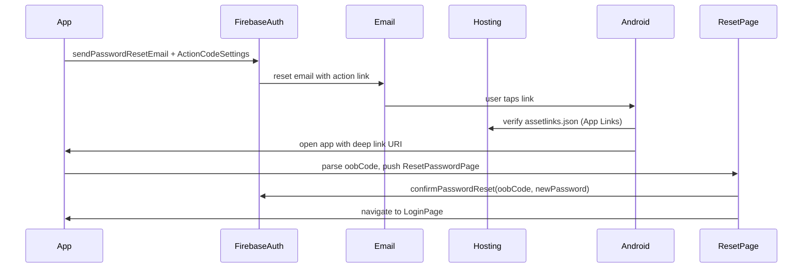

# Password reset deep links (Android)

End-to-end guide for Multichoice password-reset emails that open the app, complete the reset flow, and navigate to sign-in.

Related:

- [environment-config.md](environment-config.md) — DEV/PROD flavors, dart-defines, SHA fingerprints
- [stackmint-app-auth-domain-checklist.md](stackmint-app-auth-domain-checklist.md) — optional branded `stackmint.app` domains (PROD polish)
- [login-implementation-guide.md](login-implementation-guide.md) — auth feature overview

---

## How it works



| Layer | Responsibility |
|-------|----------------|
| **App (core)** | `ActionCodeSettings` when sending reset email (`handleCodeInApp: true`, package name) |
| **App (UI)** | `PasswordResetDeepLinkListener` parses `oobCode` and opens `ResetPasswordPage` |
| **Android manifest** | `intent-filter` with `android:autoVerify="true"` for the link host |
| **Firebase Hosting** | Serves `/.well-known/assetlinks.json` for App Link verification |
| **Firebase Console** | SHA fingerprints, authorized domains, email template |

The link in the email is a Firebase Auth **action link** (`mode=resetPassword`, `oobCode=…`, `apiKey=…`). The `apiKey` is the Firebase **Web API key** (public client identifier). It is restricted by authorized domains and Firebase security rules — it is expected to appear in the URL.

---

## Hosting vs App Hosting

Use **Firebase Hosting (classic)** — not **Firebase App Hosting**.

| Product | Use for |
|---------|---------|
| **Firebase Hosting** | Static files: `assetlinks.json`, landing pages, `index.html` |
| **Firebase App Hosting** | Full-stack frameworks (Next.js SSR, Angular App Hosting, etc.) |

Password reset only needs Hosting to publish `assetlinks.json` on the same domain as the reset link.

---

## Repo layout

| Path | Purpose |
|------|---------|
| `firebase/public/.well-known/assetlinks.json` | Android App Links verification (commit this) |
| `firebase/firebase.json` | Hosting config (`public` directory) |
| `firebase/.firebaserc` | Project aliases (`dev`, `prod`, `default`) |
| `apps/multichoice/android/app/src/main/AndroidManifest.xml` | App Link intent filters |
| `packages/core/.../registration_service.dart` | `ActionCodeSettings` on send |
| `packages/core/.../auth_environment.dart` | `AUTH_DOMAIN`, package names from dart-defines |
| `apps/multichoice/lib/app/view/auth/password_reset_deep_link_listener.dart` | Incoming link handler |
| `apps/multichoice/lib/presentation/registration/reset_password_page.dart` | Reset UI + navigation |

---

## One-time setup (DEV)

### 1. Firebase CLI

From any directory:

```powershell
npm install -g firebase-tools
# or use npx without global install:
npx -y firebase-tools@latest login
```

Run deploy commands from the Firebase config folder:

```powershell
cd C:\Programming\Projects\multichoice\firebase
npx -y firebase-tools@latest use dev
```

Project aliases in `.firebaserc`:

| Alias | Firebase project |
|-------|------------------|
| `dev` / `default` | `multichoice-app-develop` |
| `prod` | `multichoice-412309` |

### 2. Initialize Hosting (already done if `hosting` exists in `firebase.json`)

```powershell
npx -y firebase-tools@latest init hosting
```

Recommended answers:

- Public directory: **`public`**
- Single-page app rewrite: **No**
- GitHub deploys: optional

### 3. `assetlinks.json`

File: `firebase/public/.well-known/assetlinks.json`

Get your **debug SHA-256** (DEV local installs):

```powershell
cd apps\multichoice\android
.\gradlew signingReport
```

Use the **SHA-256** from the **debug** variant. Cross-check with the device:

```powershell
adb -s <device-serial> shell pm get-app-links --user 0 co.za.zanderkotze.multichoice.dev
```

The `Signatures:` line must match a fingerprint in `assetlinks.json`.

DEV example (package `co.za.zanderkotze.multichoice.dev`):

```json
[
  {
    "relation": ["delegate_permission/common.handle_all_urls"],
    "target": {
      "namespace": "android_app",
      "package_name": "co.za.zanderkotze.multichoice.dev",
      "sha256_cert_fingerprints": [
        "YOUR_DEBUG_SHA256"
      ]
    }
  }
]
```

For PROD, add a second entry (or a separate Hosting deploy) with package `co.za.zanderkotze.multichoice` and **release** SHA-256.

**Commit `assetlinks.json`** — it is public by design.

> **Deploy gotcha:** default Hosting ignore includes `**/.*`, which can skip dot-directories like `.well-known`. If the URL 404s after deploy, remove `**/.*` from `hosting.ignore` in `firebase.json` or add an exception, then redeploy.

### 4. Deploy Hosting

```powershell
cd C:\Programming\Projects\multichoice\firebase
npx -y firebase-tools@latest deploy --only hosting --project dev
```

Verify in a browser (must be **200** JSON):

`https://multichoice-app-develop.firebaseapp.com/.well-known/assetlinks.json`

### 5. Firebase Console (DEV project)

[multichoice-app-develop → Project settings](https://console.firebase.google.com/u/0/project/multichoice-app-develop/settings/general)

- **Your apps → Android (`co.za.zanderkotze.multichoice.dev`)**
  - Add **SHA-1** and **SHA-256** (debug + release when available)

[Authentication → Settings](https://console.firebase.google.com/u/0/project/multichoice-app-develop/authentication/settings)

- **Authorized domains:** keep `multichoice-app-develop.firebaseapp.com` (and custom domain later if used)
- **Sign-in method:** Email/Password enabled

[Remote Config](https://console.firebase.google.com/u/0/project/multichoice-app-develop/config): `enable_user_accounts` = `true`

### 6. Android manifest

`apps/multichoice/android/app/src/main/AndroidManifest.xml` should include:

**Activity launch mode** — use `singleTop` (not `singleTask`). Do **not** set `android:taskAffinity=""`; an empty task affinity can spawn a second app instance in recents when a link is opened from Gmail.

```xml
<activity
    android:name=".MainActivity"
    android:launchMode="singleTop"
    ...>
```

`MainActivity` must forward warm-start intents to `app_links`:

```kotlin
override fun onNewIntent(intent: Intent) {
    super.onNewIntent(intent)
    setIntent(intent)
}
```

Disable Flutter's built-in deep linker (required from Flutter 3.24+) so `app_links` receives intents:

```xml
<meta-data
    android:name="flutter_deeplinking_enabled"
    android:value="false" />
```

App Link intent filter:

```xml
<intent-filter android:autoVerify="true">
    <action android:name="android.intent.action.VIEW" />
    <category android:name="android.intent.category.DEFAULT" />
    <category android:name="android.intent.category.BROWSABLE" />
    <data android:scheme="https"
          android:host="multichoice-app-develop.firebaseapp.com" />
</intent-filter>
```

Reinstall the app after manifest or fingerprint changes.

### 7. App config

`apps/multichoice/config/develop_config.json` (gitignored locally):

```json
{
  "ANDROID_PACKAGE_NAME": "co.za.zanderkotze.multichoice.dev",
  "AUTH_DOMAIN": "multichoice-app-develop.firebaseapp.com"
}
```

The app sends reset emails with:

- `url`: `https://<AUTH_DOMAIN>`
- `handleCodeInApp: true`
- `androidPackageName` / `iOSBundleId`

### 8. Verify App Links on device

```powershell
adb devices -l
adb -s <serial> shell pm get-app-links --user 0 co.za.zanderkotze.multichoice.dev
```

Want **`verified`**, not `1024` (failed). On Samsung with Secure Folder, always pass `--user 0`.

If verification failed after deploy:

```powershell
adb -s <serial> shell pm verify-app-links --re-verify co.za.zanderkotze.multichoice.dev
```

Then reinstall the DEV app and send a **new** reset email (old links keep old settings).

---

## Device test checklist

1. Build **Debug [DEV]** with `develop_config.json`
2. Confirm app label is **`[DEV] Multichoice`** (package `.dev`)
3. Forgot password → send reset email
4. On phone, open email → tap link
5. App opens → **Reset password** screen (not browser-only)
6. Back / **Go Home** → Home screen (not Sign In)
7. Set new password → success → Login page (sign in with new password)
8. Sign in with new password

---

## Troubleshooting

| Symptom | Likely cause | Fix |
|---------|--------------|-----|
| Link opens browser | App Links not verified | Deploy `assetlinks.json`, fix SHA-256, re-verify, reinstall |
| `get-app-links` shows `1024` | `assetlinks.json` missing/wrong/mismatched SHA | Fix file, redeploy Hosting, `verify-app-links --re-verify` |
| Domains **Disabled** in `get-app-links` | Verification failed | Same as above |
| Wrong app / no handoff | Package mismatch | DEV link needs `.dev` package installed |
| Buttons dead / blue overlay | Home welcome/update modal over reset page | Fixed in app: modals skip when reset is top route |
| Back loops between Reset / Sign In | Back was pushing Login on top of Home | Fixed: deep-link reset backs to Home; success still opens Login |
| Two app instances in recents | Empty `taskAffinity` + link intent in new task | Fixed: removed `taskAffinity`, `singleTop` + `onNewIntent` in MainActivity |
| Back goes nowhere | Modal blocking or empty stack | Dismiss modals; use updated reset navigation |
| Reset submit hangs | Network / invalid `oobCode` / App Check | Check snackbar errors; use a fresh email link |
| `multiple devices` (adb) | Several emulators/phones | `adb -s <serial> ...` |
| Gmail opens in-app browser | Client behavior | Long-press → Open in browser / Chrome as sanity check |

---

## PROD rollout

Repeat for `multichoice-412309`:

1. Deploy Hosting (`assetlinks.json` with PROD package + release SHA-256)
2. SHA fingerprints for `co.za.zanderkotze.multichoice`
3. Build **PROD** flavor with `production_config.json`
4. Deploy: `npx -y firebase-tools@latest deploy --only hosting --project prod`

Optional branded domains (`auth.stackmint.app`, `dev.stackmint.app`): see [stackmint-app-auth-domain-checklist.md](stackmint-app-auth-domain-checklist.md).

---

## Customize the reset email

Firebase controls the email in the console — not in app code. The template editor accepts **plain text only** for the message body. **HTML tags (`<p>`, `<a>`, `style=…`) are not supported** and will fail validation or send as broken plain text.

### What works (plain text)

[Authentication → Templates → Password reset](https://console.firebase.google.com/u/0/project/multichoice-app-develop/authentication/emails) → edit message:

```
Hello,

Tap the link below to reset your Multichoice password:

%LINK%

If you did not request this, you can ignore this email.

Thanks,
The %APP_NAME% team
```

Rules:

- Use **`%LINK%` exactly once** — a second `%LINK%` often breaks the template.
- No HTML, no inline CSS, no `<br>` — line breaks are plain newlines.
- `%LINK%` is rendered by Firebase/email clients as a **clickable hyperlink** (the full URL, including `apiKey`, will still be visible — that is normal).

Also customize **subject**, **sender name**, and **reply-to** in the same screen.

| Variable | Meaning |
|----------|---------|
| `%LINK%` | Password-reset action URL (use once) |
| `%EMAIL%` | Recipient email |
| `%APP_NAME%` | Public-facing project name (Firebase Settings) |
| `%DISPLAY_NAME%` | Recipient display name (if set) |

### If you need a real button (styled HTML email)

Firebase built-in templates cannot do this. Options:

1. **Cloud Function + Admin SDK** — generate the link with `generatePasswordResetEmail()` / `generatePasswordResetLink()` and send your own HTML email via SendGrid, Mailgun, etc. (full branding control; more work).
2. **Custom action handler page** on Hosting — only changes the **web page** after the link is tapped, not the email appearance. See [custom email handler](https://firebase.google.com/docs/auth/custom-email-handler).

For most apps, plain text + a single `%LINK%` is the practical choice until you invest in custom email sending.

### Link domain vs template

The **host** in the email link comes from `ActionCodeSettings` in the app (`AUTH_DOMAIN`), not from the template. The template only controls surrounding text and subject.

Send a test email after every template change.

---

## Quick command reference

```powershell
# SHA fingerprints
cd apps\multichoice\android
.\gradlew signingReport

# Deploy DEV hosting
cd C:\Programming\Projects\multichoice\firebase
npx -y firebase-tools@latest deploy --only hosting --project dev

# App Links status
adb -s <serial> shell pm get-app-links --user 0 co.za.zanderkotze.multichoice.dev
adb -s <serial> shell pm verify-app-links --re-verify co.za.zanderkotze.multichoice.dev

# Run DEV app
cd apps\multichoice
flutter run --target lib/main_develop.dart --flavor dev --dart-define-from-file=config/develop_config.json
```
