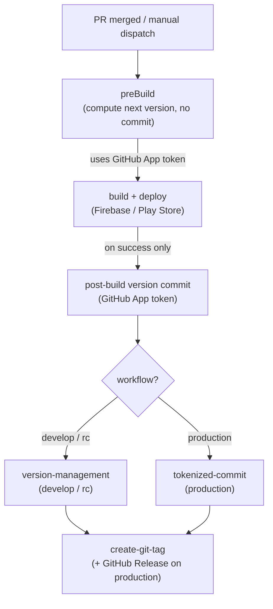

# Protected Branches and the Version Bumping GitHub App

This guide documents how CI commits version bumps to protected branches (`develop`, `rc`, and `main`) using a dedicated GitHub App instead of the default `GITHUB_TOKEN`.

Related workflows: `develop-workflow`, `rc-workflow`, and `production-workflow`.

## Why a GitHub App?

Protected branches block direct pushes from most actors. After a successful build and deploy, workflows must commit the updated `apps/multichoice/pubspec.yaml` version back to the branch.

The default `GITHUB_TOKEN` cannot push to protected branches in most setups. A GitHub App with **Contents: Read and write** permission and a branch-protection bypass entry can push those version commits safely.

## Architecture



| Workflow | Target branch | Commit action | When version is committed |
|----------|---------------|---------------|---------------------------|
| `develop-workflow` | `develop` | `version-management` | After Firebase App Distribution upload |
| `rc-workflow` | `rc` | `version-management` (with `-RC` suffix) | After Play internal track upload |
| `production-workflow` | `main` (configurable) | `tokenized-commit` | After Play production upload |

Both custom actions authenticate with the GitHub App token and commit as **VersionBumpingBot** (`bot@versionbumpingbot.com`).

## Step 1 — Create the GitHub App

1. Open **GitHub → Settings → Developer settings → GitHub Apps → New GitHub App**.
2. Set a name (for example `Multichoice Version Bot`).
3. Set **Homepage URL** to the repository URL.
4. Disable **Webhook** unless you have a separate use for it.
5. Under **Repository permissions**, set:
   - **Contents**: Read and write
   - **Metadata**: Read-only
6. Under **Where can this GitHub App be installed?**, choose **Only on this account**.
7. Click **Create GitHub App**.

## Step 2 — Generate and store credentials

1. On the app page, note the **App ID** (a numeric value).
2. Under **Private keys**, click **Generate a private key** and save the downloaded `.pem` file securely.
3. Click **Install App** and install it on the `multichoice` repository (all repositories is also fine if you reuse the app).
4. In the repository, go to **Settings → Secrets and variables → Actions** and add:

| Secret | Value |
|--------|-------|
| `VERSION_BOT_APP_ID` | App ID from step 1 |
| `VERSION_BOT_APP_PRIVATE_KEY` | Full contents of the `.pem` file |

Never commit the private key to the repository.

## Step 3 — Configure branch protection

For each protected branch that receives version commits (`develop`, `rc`, `main`):

1. Go to **Settings → Branches → Branch protection rules** and edit the rule (or create one).
2. Enable your usual protections (required reviews, status checks, and so on) for human contributors.
3. Under **Bypass list** (or **Allow specified actors to bypass required pull requests** on older UI), add the GitHub App you created.

This allows the app to push version-bump commits directly while humans still merge via PR.

### Recommended protections to keep enabled

- Require pull request reviews before merging (for developers).
- Require status checks (CI) before merging.
- Do **not** rely on `GITHUB_TOKEN` write access for version commits — the workflows already use the app token for pushes.

### What the bot commits

- `apps/multichoice/pubspec.yaml` version line only.
- Commit messages include `[skip ci]` to avoid re-triggering build workflows on the version commit itself.

## Step 4 — How workflows use the token

All three workflows generate a short-lived installation token with [`peter-murray/workflow-application-token-action@v4`](https://github.com/peter-murray/workflow-application-token-action):

```yaml
- name: Generate GitHub App Token
  id: generate_token
  uses: peter-murray/workflow-application-token-action@v4
  with:
    application_id: ${{ secrets.VERSION_BOT_APP_ID }}
    application_private_key: ${{ secrets.VERSION_BOT_APP_PRIVATE_KEY }}
```

### Develop and RC (pre-build compute)

`preBuild` calls `version-management` with `commit_changes: "false"` to compute the next version without writing to the branch. The build job uses those outputs for artifact names and deploy metadata.

### Develop and RC (post-success commit)

After a successful deploy, a second token is generated and `version-management` runs with:

- `commit_changes: "true"`
- `target_version` set to the version computed in `preBuild`
- `branch_name` set to `develop` or `rc`

RC also passes `version_suffix: "-RC"`.

### Production (post-success commit)

Production uses `tokenized-commit`, which checks out the target branch with the app token, updates `pubspec.yaml`, commits, and pushes:

```yaml
- uses: ./.github/actions/tokenized-commit
  with:
    github_token: ${{ steps.generate_token_commit.outputs.token }}
    branch_name: ${{ inputs.target_branch }}
    version_with_build: ${{ needs.preBuild.outputs.version_number }}
```

Production reads an RC version from the target branch, strips `-RC`, optionally applies a manual `release_version` override, increments the build number, deploys, then commits the final version.

## Troubleshooting

| Symptom | Likely cause | Fix |
|---------|--------------|-----|
| `Failed to push version bump` | App not on bypass list | Add app to branch protection bypass list |
| `Resource not accessible by integration` | Missing Contents write permission | Update app permissions and reinstall |
| `Bad credentials` / token errors | Wrong App ID or malformed private key secret | Re-copy App ID and full PEM into secrets |
| Version commit triggers another build | Missing `[skip ci]` in commit message | Already included by actions; check workflow triggers |
| Push rejected on protected branch | App not installed on repo | Reinstall app on the repository |

## Related files

- `.github/actions/version-management/` — compute, commit, and push with retry logic
- `.github/actions/tokenized-commit/` — production post-deploy commit
- `.github/actions/create-git-tag/` — tag creation after version commit
- `.github/workflows/develop_workflow.yml`
- `.github/workflows/staging_workflow.yml` (`rc-workflow`)
- `.github/workflows/production_workflow.yml` (`production-workflow`)

## See also

- [Workflows overview](workflows/README.md)
- [GitHub Apps documentation](https://docs.github.com/en/apps/creating-github-apps)
- [About protected branches](https://docs.github.com/en/repositories/configuring-branches-and-merges-in-your-repository/managing-protected-branches/about-protected-branches)
