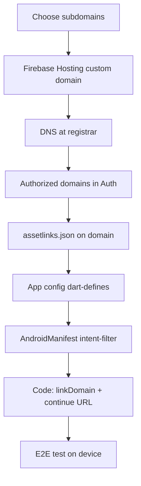

# stackmint.app — Firebase Auth & password-reset domain checklist

Use this checklist to connect **stackmint.app** (or subdomains) to Multichoice Firebase Auth action links so password-reset emails can open the Android app with an `oobCode`.

Related:

- [password-reset-deep-links.md](password-reset-deep-links.md) — **start here** for DEV setup with default `firebaseapp.com` + Hosting + `assetlinks.json`
- [environment-config.md](environment-config.md) — dart-defines, flavors, `#335` auth console checklist
- [login-implementation-guide.md](login-implementation-guide.md) — auth feature overview
- In-repo deep link listener: `apps/multichoice/lib/app/view/auth/password_reset_deep_link_listener.dart`
- `ActionCodeSettings` sender: `packages/core/lib/src/services/implementations/registration_service.dart`

---

## Recommended domain layout

Use **one subdomain per Firebase project** (do not share one Hosting site across DEV and PROD unless you deliberately design routing).

| Environment | Firebase project | Android package | Suggested auth link host |
|-------------|------------------|-----------------|-------------------------|
| DEV | [multichoice-app-develop](https://console.firebase.google.com/u/0/project/multichoice-app-develop/overview) | `co.za.zanderkotze.multichoice.dev` | `dev.stackmint.app` |
| PROD | [multichoice-412309](https://console.firebase.google.com/u/0/project/multichoice-412309/overview) | `co.za.zanderkotze.multichoice` | `auth.stackmint.app` |

Keep `AUTH_DOMAIN` in config as the **Firebase project domain** (`*.firebaseapp.com`). Branded reset links use separate keys (see [App config](#app-config-dart-defines) below).

---

## Checklist overview



---

## 1. Firebase Hosting — custom domain

Do this **once per Firebase project**.

### DEV (`multichoice-app-develop`)

- [ ] Firebase Console → **Hosting** → **Add custom domain**
- [ ] Enter `dev.stackmint.app` (or your chosen DEV subdomain)
- [ ] Complete domain verification (TXT record at registrar)
- [ ] Add DNS records Firebase provides (usually `A` / `CNAME` to Hosting)
- [ ] Wait until Hosting shows the domain as **Connected**

### PROD (`multichoice-412309`)

- [ ] Repeat for `auth.stackmint.app` (or your chosen PROD subdomain)
- [ ] Confirm SSL certificate is active on the custom domain

### Optional Hosting content

- [ ] Deploy a minimal `public/index.html` (or empty site) if Firebase prompts for a first deploy
- [ ] Ensure `/.well-known/` paths are served over HTTPS (see [section 4](#4-android-app-links-assetlinksjson))

---

## 2. DNS (registrar for stackmint.app)

For each subdomain (`dev`, `auth`, …):

- [ ] Add **domain verification** TXT record (from Firebase Hosting setup)
- [ ] Add **Hosting** `A` and/or `CNAME` records exactly as Firebase lists
- [ ] Confirm propagation: `nslookup dev.stackmint.app` / `auth.stackmint.app`

---

## 3. Firebase Authentication — console

Complete for **each** project (DEV + PROD).

### Authorized domains

Authentication → **Settings** → **Authorized domains**

- [ ] Add `dev.stackmint.app` (DEV project)
- [ ] Add `auth.stackmint.app` (PROD project)
- [ ] Keep existing `localhost` / `*.firebaseapp.com` entries as needed

### Sign-in methods (#335)

- [ ] **Email/Password** enabled
- [ ] **Google** enabled
- [ ] SHA-1 and SHA-256 fingerprints added for the matching Android package (debug + release)

### Email templates

Authentication → **Templates** → **Password reset**

- [ ] Customize subject/body (optional branding)
- [ ] Note: the **link domain** in the email is driven by `ActionCodeSettings` from the app, not the template editor alone
- [ ] After setup, send a test reset email and confirm the link host is your `stackmint.app` subdomain (once app config + `linkDomain` are wired)

### Email verification (policy)

- [ ] Verification email is sent on email sign-up (already implemented in app)
- [ ] **No enforcement** in app today — document if product later requires verified-email gate

---

## 4. Android App Links — `assetlinks.json`

Host this at:

`https://<subdomain>.stackmint.app/.well-known/assetlinks.json`

Example path on Firebase Hosting: `public/.well-known/assetlinks.json`

### Generate SHA-256 certificate fingerprints

```powershell
cd apps/multichoice/android
.\gradlew signingReport
```

Use the **SHA-256** for:

- [ ] Debug keystore (local DEV testing)
- [ ] Release keystore (Play / PROD)

### Example `assetlinks.json` (PROD)

Replace `YOUR_RELEASE_SHA256` with the fingerprint from `signingReport` (colon-separated, uppercase).

```json
[
  {
    "relation": ["delegate_permission/common.handle_all_urls"],
    "target": {
      "namespace": "android_app",
      "package_name": "co.za.zanderkotze.multichoice",
      "sha256_cert_fingerprints": [
        "YOUR_RELEASE_SHA256"
      ]
    }
  }
]
```

### DEV variant

- [ ] Separate file or separate Hosting site with `package_name`: `co.za.zanderkotze.multichoice.dev`
- [ ] Include debug SHA-256 for emulator/local installs

### Verify

- [ ] `https://auth.stackmint.app/.well-known/assetlinks.json` returns `200` and valid JSON
- [ ] [Google Statement List Tester](https://developers.google.com/digital-asset-links/tools/generator) — no errors for package + domain

---

## 5. App config (dart-defines)

Files (gitignored locally): `apps/multichoice/config/develop_config.json`, `production_config.json`

### Already in place

| Key | DEV | PROD |
|-----|-----|------|
| `ANDROID_PACKAGE_NAME` | `co.za.zanderkotze.multichoice.dev` | `co.za.zanderkotze.multichoice` |
| `AUTH_DOMAIN` | `multichoice-app-develop.firebaseapp.com` | `multichoice-412309.firebaseapp.com` |

### Add when custom domain is live (code change required)

| Key | DEV example | PROD example |
|-----|-------------|--------------|
| `PASSWORD_RESET_CONTINUE_URL` | `https://dev.stackmint.app` | `https://auth.stackmint.app` |
| `PASSWORD_RESET_LINK_DOMAIN` | `dev.stackmint.app` | `auth.stackmint.app` |

- [ ] Add keys to `develop_config.json` and `production_config.json`
- [ ] Update `packages/core/lib/src/config/auth_environment.dart` to read them
- [ ] Pass `linkDomain` in `ActionCodeSettings` inside `registration_service.dart`
- [ ] Regenerate / update CI secrets: `DEV_CONFIG_B64`, `PROD_CONFIG_B64` (see [environment-config.md](environment-config.md))

`AppConfig` (`apps/multichoice/lib/config/app_config.dart`) only needs new fields if app-layer code reads them; core auth already uses `AuthEnvironment` via dart-defines.

---

## 6. Android manifest

File: `apps/multichoice/android/app/src/main/AndroidManifest.xml`

**Today:** intent-filter hosts are `multichoice-app-develop.firebaseapp.com` and `multichoice-412309.firebaseapp.com`.

When `stackmint.app` subdomains are live:

- [ ] Add `<data android:scheme="https" android:host="dev.stackmint.app" />`
- [ ] Add `<data android:scheme="https" android:host="auth.stackmint.app" />`
- [ ] Keep `android:autoVerify="true"` on the intent-filter
- [ ] Reinstall app and confirm App Links verification (Settings → Apps → Multichoice → Open by default)

---

## 7. iOS (future)

When an iOS target exists:

- [ ] Associated Domains: `applinks:dev.stackmint.app`, `applinks:auth.stackmint.app`
- [ ] Host `apple-app-site-association` on each subdomain
- [ ] Set `IOS_BUNDLE_ID` in flavor config files

---

## 8. End-to-end verification

On a **physical device** (email clients differ from emulator):

1. [ ] Remote Config: `enable_user_accounts` = `true`
2. [ ] Build correct flavor (DEV or PROD) with updated `--dart-define-from-file`
3. [ ] Sign in or use **Forgot password** with a real email
4. [ ] Open reset email on device
5. [ ] Tap link → **Multichoice opens** (not browser-only)
6. [ ] App navigates to **Reset Password** with `oobCode` (not the dev mock error)
7. [ ] Set new password → sign in with new password

### If the link opens the browser instead of the app

| Symptom | Likely cause |
|---------|----------------|
| Browser opens Firebase handler | `linkDomain` missing or wrong; custom domain not on Hosting |
| App does not appear in link targets | `assetlinks.json` missing/wrong SHA-256 or package name |
| Wrong app / flavor | `ANDROID_PACKAGE_NAME` mismatch (DEV vs PROD) |
| `ApiException: 10` on Google sign-in | SHA-1 not in Firebase project settings |

---

## 9. Repo vs console — status tracker

| Item | Where | Status |
|------|--------|--------|
| `app_links` listener | App | Done |
| Basic `ActionCodeSettings` (`url`, `handleCodeInApp`, package IDs) | Core | Done |
| `linkDomain` + `PASSWORD_RESET_*` config keys | Core + config | **Pending** |
| Android intent-filter for `stackmint.app` | Manifest | **Pending** |
| Firebase Hosting + DNS | Console | **Pending** |
| `assetlinks.json` on custom domain | Hosting | **Pending** |
| Authorized domains for subdomains | Auth console | **Pending** |
| Tests for `ActionCodeSettings` forwarding | Core tests | **Pending** |
| E2E device test | Manual | **Pending** |

---

## 10. Quick reference — console links

| Task | DEV | PROD |
|------|-----|------|
| Project overview | [multichoice-app-develop](https://console.firebase.google.com/u/0/project/multichoice-app-develop/overview) | [multichoice-412309](https://console.firebase.google.com/u/0/project/multichoice-412309/overview) |
| Hosting | [Hosting](https://console.firebase.google.com/u/0/project/multichoice-app-develop/hosting) | [Hosting](https://console.firebase.google.com/u/0/project/multichoice-412309/hosting) |
| Auth settings | [Authentication](https://console.firebase.google.com/u/0/project/multichoice-app-develop/authentication/settings) | [Authentication](https://console.firebase.google.com/u/0/project/multichoice-412309/authentication/settings) |
| Templates | [Templates](https://console.firebase.google.com/u/0/project/multichoice-app-develop/authentication/emails) | [Templates](https://console.firebase.google.com/u/0/project/multichoice-412309/authentication/emails) |

---

## Subdomain naming

If you prefer different names, replace `dev.stackmint.app` / `auth.stackmint.app` everywhere consistently:

- DNS / Hosting
- Authorized domains
- `PASSWORD_RESET_CONTINUE_URL` / `PASSWORD_RESET_LINK_DOMAIN`
- `AndroidManifest.xml` hosts
- `assetlinks.json` deployment URL

Do **not** point both Firebase projects at the same subdomain without explicit routing design.
